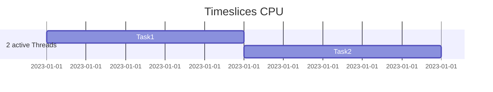
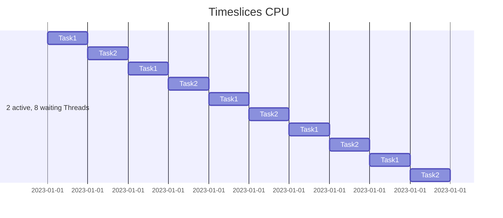

## Threads, Threadpools, Contextswitches

### Einfluß wartender Threads auf das Timeslicing

Auch blockierende Threads zählen für den Scheduler (Hardwareebene) und lösen somit öfters einen context switch aus.

Blockierende, wartende Threads werden dann beim Scheduling zwar nicht "aktiviert", verursachen aber, daß es öfters context switches gibt.

Anbei ein Bildchen, was das oben gesagte veranschaulichen soll. (Das Datum ist nur drin, weil ich das mit dem gantt Diagramm nicht anders hinbekommen habe)

### Einfluß wartender Threads auf den GC (Jvm)

Der GC geht immer über den ganzen Heap und startet von jedem Thread.
Je mehr Threads desto länger braucht der GC
