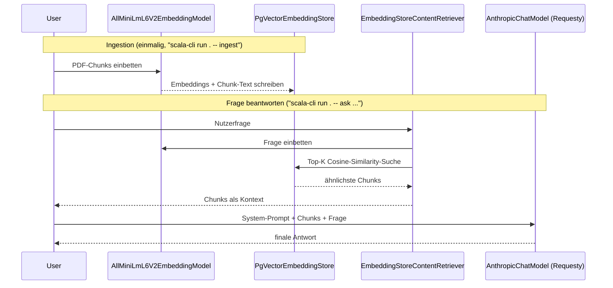

# RAG-Lernbeispiel: PDFs, pgvector & langchain4j (Scala 3.9.0 / scala-cli)

Ziel: Verstehen, wie sich eine **Retrieval-Augmented-Generation (RAG)**-Pipeline
aufbauen lässt, wenn man dafür eine fertige Library (**langchain4j**) statt
eigenem Code nutzt - von der PDF-Ingestion über eine echte Vektordatenbank
(Postgres + pgvector) bis zur Antwortgenerierung mit einem LLM.

Dieses Projekt ist das bewusste **Gegenstück zu [`ai-rag-sttpai`](../ai-rag-sttpai)**:
Dort wird jeder Schritt (PDF-Parsing, Chunking, Embeddings, Vektorsuche,
Prompt-Bau) von Hand implementiert, um den Mechanismus dahinter sichtbar zu
machen. Hier übernimmt `langchain4j` fast die komplette Pipeline - der
Lerneffekt liegt darin, zu sehen, *welche* Bausteine eine RAG-Library
mitbringt und wie wenig eigener Code dafür nötig ist.

Aufgabe des Systems: 10 lokale, thematisch völlig unterschiedliche PDF-Dateien
(`docs/`, z. B. zu Vulkanen, Schach, Kaffee oder dem Great Barrier Reef) werden
in Textchunks zerlegt, lokal (ohne API-Call) mit einem Embedding-Modell
vektorisiert und in eine pgvector-Datenbank geschrieben. Eine Nutzerfrage wird
anschließend ebenfalls eingebettet, die ähnlichsten Chunks werden gesucht und
zusammen mit der Frage an ein LLM geschickt, das daraus die finale Antwort
generiert.

## Tech-Stack

| Zweck                            | Bibliothek                                                                                                                  |
|-----------------------------------|------------------------------------------------------------------------------------------------------------------------------|
| RAG-Orchestrierung                | [langchain4j](https://docs.langchain4j.dev/) (`dev.langchain4j:langchain4j`)                                                |
| PDF -> `Document`                 | `langchain4j-document-parser-apache-pdfbox` (nutzt intern Apache PDFBox)                                                     |
| Chunking                          | `DocumentSplitters.recursive(...)` (eingebaut, versucht Absatz-/Satz-/Wortgrenzen einzuhalten)                               |
| Embeddings                        | `langchain4j-embeddings-all-minilm-l6-v2` - **in-process**, läuft lokal über ONNX Runtime, **kein** API-Key nötig            |
| Vektordatenbank                   | [pgvector](https://github.com/pgvector/pgvector) auf Postgres 18 (`docker/sql-rag/`, Container `postgres-rag`)               |
| Anbindung an pgvector             | `langchain4j-pgvector` - legt Tabelle/Index selbst an, kein eigenes SQL nötig                                                |
| LLM (Antwortgenerierung)          | `langchain4j-anthropic`, Requesty-Router, Modell `vertex/claude-sonnet-5@eu` (wie die anderen `ai-*`-Projekte)               |
| Verdrahtung Retrieval + LLM       | `AiServices` + `EmbeddingStoreContentRetriever` (beides langchain4j-Bordmittel, siehe unten)                                 |
| Dateisystemzugriff (`docs/`)      | [os-lib](https://github.com/com-lihaoyi/os-lib)                                                                              |
| PDF-Erzeugung der Beispieldaten   | [Apache PDFBox](https://pdfbox.apache.org/) 3.x (nur für `generate-docs`, nicht Teil der eigentlichen RAG-Pipeline)           |
| Umgebungsvariablen                 | `sys.env` direkt (keine eigene `.env`-Datei-Logik, siehe Abschnitt "Credentials")                                           |
| Tests (Chunking, ohne LLM-/DB-Call) | [MUnit](https://scalameta.org/munit/) (`scala-cli test .`)                                                                 |
| Build/Run ohne sbt-Projekt        | `scala-cli` mit `//> using`-Direktiven                                                                                       |

Keine sbt-`build.sbt` nötig - alle Abhängigkeiten werden per Direktive in
`project.scala` deklariert.

## Vergleich: `ai-rag-sttpai` (von Hand) vs. `ai-rag-langchain4j` (Library)

| Schritt                     | `ai-rag-sttpai`                                                        | `ai-rag-langchain4j`                                                            |
|------------------------------|-------------------------------------------------------------------------|------------------------------------------------------------------------------------|
| PDF -> Text                | eigener `PdfTextExtractor` (PDFBox direkt)                             | `ApachePdfBoxDocumentParser` + `FileSystemDocumentLoader.loadDocument(...)`        |
| Chunking                   | eigene `Chunking.scala` (feste Zeichenfenster + Overlap)                | `DocumentSplitters.recursive(chunkSize, chunkOverlap)`                             |
| Embeddings                 | selbstgebauter Hashing-Trick + TF-IDF (`HashingTfIdfEmbedder`)          | fertiges, lokales ONNX-Modell `all-MiniLM-L6-v2` (384 Dimensionen)                 |
| IDF-Modell/Vokabular        | muss manuell gefittet und in `tfidf_model` persistiert werden            | entfällt komplett - das Embedding-Modell ist bereits trainiert, kein Fit-Schritt   |
| Vektordatenbank-Zugriff     | reines SQL/JDBC, Tabelle `document_chunks`, Index per Hand angelegt     | `PgVectorEmbeddingStore` legt Tabelle `langchain4j_pdf_chunks` + Index selbst an   |
| Verdrahtung Ingestion       | `ingestion/Ingestion.scala` ruft Chunking/Embedder/VectorStore einzeln auf         | `EmbeddingStoreIngestor` kapselt Splitten + Embedden + Schreiben in einem Aufruf   |
| Verdrahtung Retrieval + LLM | 3-stufige Agenten-Pipeline (Query-Rewriter -> Relevance-Grader -> Synthesis), jede Stufe ein eigener LLM-Call | `AiServices` + `EmbeddingStoreContentRetriever`, EIN LLM-Call pro Frage |
| Code-Umfang (ca.)           | ~15 Scala-Dateien, viel Infrastruktur-Code                               | ~10 Dateien, die meisten nur wenige Zeilen Verdrahtung                             |

**Kein Projekt ist "besser"** - `ai-rag-sttpai` zeigt, *wie* TF-IDF-Embeddings,
Cosine-Similarity-Suche und eine Agenten-Pipeline im Detail funktionieren.
Dieses Projekt zeigt, wie viel davon man sich mit einer ausgereiften Library
sparen kann - und wo man dafür Kontrolle/Transparenz gegen Komfort eintauscht
(z. B.: Welche Prompt-Vorlage nutzt `AiServices` intern genau? Siehe
"Stolpersteine" unten).

## Infrastruktur: derselbe `postgres-rag`-Container wie `ai-rag-sttpai`

Dieses Projekt nutzt bewusst **denselben** `postgres-rag`-Container (siehe
`docker/docker-compose.yml`, pgvector-Image, Port 5434, Datenbank `ragdb`) wie
sein Schwesterprojekt `ai-rag-sttpai` - es muss also keine weitere
Docker-Infrastruktur aufgesetzt werden. Damit sich beide Projekte nicht in die
Quere kommen, schreibt dieses Projekt in eine **eigene Tabelle**
(`langchain4j_pdf_chunks`, 384 Dimensionen für `all-MiniLM-L6-v2`) statt in
`document_chunks` (512 Dimensionen, TF-IDF) aus `ai-rag-sttpai`. Diese Tabelle
wird von `langchain4j-pgvector` selbst angelegt - es gibt dafür **kein** eigenes
SQL-Init-Skript in `docker/sql-rag/`.

Starten:

```bash
cd docker
docker compose up -d postgres-rag
```

## Die RAG-Pipeline



Im Unterschied zu `ai-rag-sttpai` gibt es hier **keine** mehrstufige
Agenten-Pipeline (kein Query-Rewriting, kein separates Relevance-Grading) - nur
einen einzigen `AiServices`-Aufruf, der Retrieval und LLM-Call intern
verdrahtet. Das ist der Standard-Baustein, den die meisten langchain4j-RAG-Tutorials
zeigen; eine eigene mehrstufige Pipeline (wie in `ai-rag-sttpai`) ließe sich
bei Bedarf trotzdem über eine eigene `RetrievalAugmentor`-Implementierung
nachrüsten.

### Die zentralen langchain4j-Bausteine

| Baustein                         | Rolle                                                                                                      | Datei                  |
|-----------------------------------|---------------------------------------------------------------------------------------------------------|-------------------------|
| `Document` / `FileSystemDocumentLoader` | Lädt eine Datei + Parser in ein einheitliches `Document`-Objekt (Text + Metadaten)                 | `ingestion/Ingestion.scala`        |
| `ApachePdfBoxDocumentParser`      | Wandelt den Byte-Inhalt einer PDF-Datei in reinen Text um                                                  | `ingestion/Ingestion.scala`        |
| `DocumentSplitter`                | Zerlegt ein `Document` in `TextSegment`-Chunks mit konfigurierbarer Größe/Overlap                           | `ingestion/Ingestion.scala`        |
| `EmbeddingModel`                  | Bildet Text auf einen festdimensionalen Vektor ab (`all-MiniLM-L6-v2`, 384 Dimensionen, läuft lokal)        | `EmbeddingModels.scala`  |
| `EmbeddingStore[TextSegment]`     | Abstraktion für "Vektordatenbank" - hier `PgVectorEmbeddingStore`, legt Tabelle/Index selbst an             | `VectorStore.scala`      |
| `EmbeddingStoreIngestor`          | Verdrahtet Splitter + Embedding-Modell + Store zu einem einzigen `ingest(documents)`-Aufruf                 | `ingestion/Ingestion.scala`        |
| `EmbeddingStoreContentRetriever`  | Bettet eine Frage ein, sucht die ähnlichsten Chunks im Store und liefert sie als `Content`-Liste zurück     | `query/RagAssistant.scala`     |
| `AiServices`                      | Erzeugt zur Laufzeit eine Proxy-Implementierung eines eigenen Interfaces, die Retrieval + Prompt-Bau + LLM-Call automatisch verknüpft | `query/RagAssistant.scala` |
| `@SystemMessage`                  | Annotation auf der Interface-Methode - legt den System-Prompt fest, den `AiServices` bei jedem Call voranstellt | `query/RagAssistant.scala` |

## Wichtige Begriffe / Terminologie

- **RAG (Retrieval-Augmented Generation)**: Ein LLM beantwortet Fragen nicht
  nur aus seinem Trainingswissen, sondern bekommt zusätzlich per Suche
  (Retrieval) gefundene, externe Textstellen als Kontext mitgegeben -
  reduziert Halluzinationen und ermöglicht Antworten zu Dokumenten, die dem
  Modell beim Training unbekannt waren.
- **Chunking**: Zerlegen eines langen Textes in kleinere, in sich
  abgeschlossene Abschnitte - ein einzelner Embedding-Vektor repräsentiert
  sonst zu viele unterschiedliche Themen auf einmal und wird unspezifisch.
- **Overlap**: Bewusste Zeichen-Überlappung zwischen benachbarten Chunks,
  damit ein entscheidender Satz nicht exakt an einer Chunk-Grenze zerschnitten
  wird.
- **Embedding**: Text wird auf einen festdimensionalen, numerischen Vektor
  abgebildet - inhaltlich ähnliche Texte liegen im Vektorraum nah beieinander.
  `all-MiniLM-L6-v2` ist ein kleines, vortrainiertes Sentence-Transformer-Modell
  und erfasst (anders als TF-IDF in `ai-rag-sttpai`) auch semantische Ähnlichkeit
  jenseits reiner Wortüberschneidung.
- **In-process-Modell**: Das Embedding-Modell läuft als ONNX-Modell direkt in
  der JVM (über ONNX Runtime), nicht als externer API-Call - kein Netzwerk,
  kein zusätzlicher API-Key, dafür zusätzlicher Startup-/Speicher-Overhead
  beim ersten Laden des Modells.
- **Cosine-Similarity / Cosine-Distanz**: Winkel zwischen zwei Vektoren als
  Ähnlichkeitsmaß, unabhängig von deren Länge - `langchain4j-pgvector` nutzt
  dafür intern denselben `<=>`-Operator von pgvector wie `ai-rag-sttpai`.
- **Vektordatenbank**: Eine Datenbank, die neben klassischen Spalten auch
  Vektor-Spalten unterstützt und dafür spezialisierte Ähnlichkeits-Indizes
  anbietet (hier: pgvector), um die nächsten Nachbarn eines Such-Vektors
  effizient zu finden, ohne jede Zeile einzeln vergleichen zu müssen.
- **Retrieval**: Das Suchen der zu einer Anfrage passendsten Chunks in der
  Vektordatenbank (`EmbeddingStoreContentRetriever.retrieve`).
- **Grounding**: Antworten eines Modells durch tatsächlich vorgelegten,
  verifizierbaren Text absichern statt sich nur auf internes Modellwissen zu
  verlassen.
- **AiServices (langchain4j)**: Deklarativer Ansatz, bei dem man nur ein
  Interface mit Methodensignatur + Annotationen (`@SystemMessage`) definiert -
  langchain4j generiert zur Laufzeit eine Implementierung, die Retrieval,
  Prompt-Aufbau und den eigentlichen LLM-Call übernimmt.

## Projektstruktur

```
ai-rag-langchain4j/
├── project.scala              # scala-cli Direktiven: Scala-Version, Abhängigkeiten, MUnit
├── docs/                       # generierte Beispiel-PDFs (siehe `generate-docs`)
├── PgConfig.scala              # Verbindungsdaten zu postgres-rag/ragdb + Tabellenname (liest sys.env) - von ingestion/ und query/ genutzt
├── EmbeddingModels.scala       # das lokale all-MiniLM-L6-v2-Embedding-Modell - von ingestion/ und query/ genutzt
├── VectorStore.scala           # baut den PgVectorEmbeddingStore (legt Tabelle/Index selbst an) - von ingestion/ und query/ genutzt
├── ingestion/                  # Hauptfunktion 1: PDFs lesen, vektorisieren, in pgvector schreiben
│   ├── SampleDocs.scala        #   Inhalte der 10 Beispiel-PDFs (Vulkane, Schach, Kaffee, ...)
│   ├── GenerateSampleDocs.scala #   erzeugt die Beispiel-PDFs in docs/ (PDFBox)
│   └── Ingestion.scala         #   PDFs laden -> splitten -> embedden -> in pgvector schreiben
├── query/                      # Hauptfunktion 2: Frage einlesen, Vektorsuche, Antwort vom LLM
│   ├── LlmConfig.scala         #   AnthropicChatModel (Requesty-Router, vertex/claude-sonnet-5@eu)
│   └── RagAssistant.scala      #   AiServices-Interface + ContentRetriever-Verdrahtung
├── Main.scala                  # Einstiegspunkt mit Subcommands: generate-docs / ingest / ask
├── test/
│   └── ChunkingTest.test.scala # MUnit-Test für den Splitter (kein LLM-/DB-Call)
└── README.md
```

Die Aufteilung in `ingestion/` und `query/` folgt bewusst den zwei fachlich
unabhängigen Hauptfunktionen einer RAG-Pipeline (Indexieren vs. Fragen
beantworten, siehe Sequenzdiagramm oben) - wer nur eine der beiden Seiten
verstehen will, muss sich nicht durch den Code der jeweils anderen Seite
wühlen. Nur die paar gemeinsam genutzten Bausteine (Konfiguration,
Embedding-Modell, Vektorstore) bleiben im Projekt-Root.

## Ausführen

Voraussetzung: `postgres-rag`-Container läuft (siehe oben) sowie die
Umgebungsvariable `ANTHROPIC_API_KEY` ist gesetzt (Requesty-Key, identisch zum
Key in `ai-rag-sttpai/.env`). Dieses Projekt liest Umgebungsvariablen direkt
über `sys.env` (keine eigene `.env`-Parser-Klasse, siehe Abschnitt
"Credentials") - die `.env`-Datei in diesem Projektordner wird stattdessen
über [direnv](https://direnv.net/) automatisch in echte Umgebungsvariablen
geladen (`.envrc` enthält dafür nur die eine Zeile `dotenv`, analog zu
`cli/azureCli`): einmalig `direnv allow` in diesem Ordner ausführen, danach
setzt direnv `ANTHROPIC_API_KEY` beim Betreten des Ordners automatisch.
Ohne direnv funktioniert es genauso mit einem manuellen `export
ANTHROPIC_API_KEY="rqsty-sk-..."`.

```bash
cd cli/ai-rag-langchain4j

# 1. einmalig: die 10 Beispiel-PDFs erzeugen
scala-cli run --suppress-experimental-warning . -- generate-docs

# 2. PDFs laden, splitten, embedden, in pgvector schreiben (jederzeit wiederholbar,
#    löscht/erzeugt die Tabelle dabei jedes Mal neu - keine Duplikate)
scala-cli run --suppress-experimental-warning . -- ingest

# 3. Fragen stellen
scala-cli run --suppress-experimental-warning . -- ask "Wie viele Kilometer lang ist das Great Barrier Reef und wie viele Riffe umfasst es?"
scala-cli run --suppress-experimental-warning . -- ask "Wer hält den Marathon-Weltrekord der Frauen und wo wurde er aufgestellt?"

# Tests (reine Splitter-Logik, kein API-/DB-Call nötig)
scala-cli test --suppress-experimental-warning .
```

Der erste `ingest`- bzw. `ask`-Lauf dauert spürbar länger, weil
`all-MiniLM-L6-v2` (ein paar Dutzend MB ONNX-Modelldatei) beim ersten Zugriff
aus der Dependency geladen und initialisiert wird.

## Credentials

Der API-Key wird direkt aus der echten Umgebungsvariable `ANTHROPIC_API_KEY`
gelesen (`sys.env("ANTHROPIC_API_KEY")`, siehe `query/LlmConfig.scala`) und
gegen den Requesty-Router (`https://router.eu.requesty.ai`, Modell
`vertex/claude-sonnet-5@eu`) authentifiziert. Fehlt die Variable, bricht der
Zugriff mit einer `NoSuchElementException` ab, die den fehlenden Variablennamen
nennt - bewusst **keine** eigene `.env`-Parser-Klasse wie in `ai-rag-sttpai`
(`object Env`): Für ein Lernbeispiel genügt eine einzige, vom Betriebssystem
bereitgestellte Umgebungsvariable; eine zusätzliche Parser-Klasse dafür wäre
nur zusätzlicher Code ohne didaktischen Mehrwert.

Die `.env`-Datei in diesem Ordner bleibt trotzdem bestehen - sie wird nur
nicht mehr von eigenem Scala-Code gelesen, sondern von
[direnv](https://direnv.net/) über `.envrc` (`dotenv`) automatisch in echte
Umgebungsvariablen umgewandelt, sobald man in diesen Ordner wechselt (einmalig
`direnv allow` nötig). Dieselbe `.env`-Datei funktioniert also sowohl für
`ai-rag-sttpai` (liest sie selbst per `object Env`) als auch für dieses
Projekt (liest `sys.env`, befüllt von direnv) - nur der Weg, wie der Inhalt in
die Umgebungsvariable gelangt, unterscheidet sich.

Die Postgres-Zugangsdaten (`postgres-rag`, Port 5434, DB `ragdb`) sind als
Dev-Defaults direkt in `PgConfig.scala` hinterlegt (passend zu
`docker/docker-compose.yml`) und lassen sich bei Bedarf über die
Umgebungsvariablen `PGRAG_HOST`, `PGRAG_PORT`, `PGRAG_DATABASE`, `PGRAG_USER`,
`PGRAG_PASSWORD` überschreiben (z. B. ebenfalls über dieselbe `.env`-Datei).

## Stolpersteine

**1. `AnthropicChatModel.baseUrl(...)` erwartet bereits ein `/v1`-Suffix:**
Anders als der in `ai-rag-sttpai`/den `ai-sttpai-*`-Projekten genutzte
sttp-ai-Client (dessen `ClaudeConfig.baseUrl` nur den Host erwartet und
`v1/messages` selbst anhängt) baut langchain4js `DefaultAnthropicClient` die
URL aus `baseUrl + "/" + "messages"` zusammen - `baseUrl` muss hier also
bereits `https://router.eu.requesty.ai/v1` lauten, nicht nur
`https://router.eu.requesty.ai`. Ohne das `/v1`-Suffix antwortet der Router
mit `404 page not found`. Siehe `query/LlmConfig.scala`.

**2. `langchain4j-pgvector` verbindet sich über Einzelfelder, nicht über eine
JDBC-URL:** `PgVectorEmbeddingStore.builder()` erwartet `host`/`port`/
`database`/`user`/`password` separat statt einer zusammengesetzten
`jdbc:postgresql://...`-URL wie in `ai-rag-sttpai/Db.scala` - deshalb liegen
diese Werte hier einzeln in `PgConfig.scala`.

**3. Eigene Tabelle statt eigener Datenbank:** `langchain4j-pgvector` kann die
Zieltabelle selbst anlegen (`createTable(true)`, Default) und bei Bedarf vorher
leeren (`dropTableFirst(true)`) - ein eigenes SQL-Init-Skript wie
`docker/sql-rag/01-ragdb.sql` in `ai-rag-sttpai` ist dafür nicht nötig. Wichtig
ist nur, eine **andere** Tabelle als `document_chunks` zu wählen
(`langchain4j_pdf_chunks`), da beide Projekte sich sonst denselben Tabellennamen
mit inkompatibler Vektordimension (512 vs. 384) teilen würden.

**4. JDK-Warnungen beim Start (gelöst statt nur dokumentiert):** Auf neueren
JDKs (hier getestet mit JDK 27) erscheinen ohne Gegenmaßnahme bei jedem
`run`/`test` drei Arten von Warnungen, die nichts mit Programmfehlern zu tun
haben, sondern mit JVM- bzw. Classpath-Details:

- `WARNING: A terminally deprecated method in sun.misc.Unsafe has been
  called ... by scala.runtime.LazyVals$` - `scala.runtime.LazyVals$` ist die
  gemeinsame Laufzeit-Unterstützungsklasse für `lazy val` in der
  `scala3-library`-JAR selbst. Ob sie beim Zugriff auf einen konkreten
  `lazy val` den alten (`Unsafe`-basierten) oder neuen (`VarHandle`-basierten)
  Codepfad nimmt, hängt nicht von der eigenen Scala-Version ab, sondern davon,
  mit welcher Scala-3-Version die jeweilige `lazy val`-Stelle kompiliert wurde
  - das kann auch eine transitive Abhängigkeit sein, die noch mit einer
  älteren Scala-3.x-Version (< 3.8, dem Release, das den `Unsafe`-Zugriff
  entfernt hat) gebaut wurde. Ab JDK 24 warnt die JVM standardmäßig davor
  (JEP 498). Behoben über die scala-cli-Direktive `//> using sloth` (siehe
  `project.scala`), die das `Unsafe`-basierte Bytecode-Muster über den
  gesamten Klassenpfad hinweg (also auch in Abhängigkeiten) auf das
  JDK-26-kompatible Muster patcht - kein eigener Workaround-Code nötig, nur
  eine Zeile in `project.scala`.
- `sloth`-Direktive selbst ist "experimental":** scala-cli druckt beim Start
  für jede als experimentell markierte Direktive einen mehrzeiligen Hinweis
  ("non-ideal user experience should be expected ..."). Das lässt sich nicht
  über eine weitere `project.scala`-Direktive abstellen (es gibt dafür keine
  `using`-Entsprechung, nur die CLI-Flag), sondern nur über die
  Kommandozeilen-Option `--suppress-experimental-warning` (siehe die
  `scala-cli run`/`test`-Aufrufe oben) - deshalb taucht sie in diesem Projekt
  in jedem Befehl explizit mit auf, statt einmalig in `project.scala` zu
  stehen.
- `WARNING: A restricted method in java.lang.System has been called ... by
  ai.onnxruntime.OnnxRuntime` - das Embedding-Modell (`all-MiniLM-L6-v2`, siehe
  `EmbeddingModels.scala`) lädt eine native ONNX-Runtime-Bibliothek per
  `System::load` (JEP 472, "Prepare to Restrict the Use of JNI"). Behoben über
  `//> using javaOpt --enable-native-access=ALL-UNNAMED` in `project.scala`.
- `SLF4J(W): No SLF4J providers were found` - langchain4j nutzt intern SLF4J
  für Logging, ohne konkrete Implementierung auf dem Klassenpfad meldet SLF4J
  das bei jedem Start. Behoben durch die zusätzliche Abhängigkeit
  `org.slf4j:slf4j-nop` (ein No-Op-Logging-Backend) in `project.scala` - dieses
  Projekt braucht keine Logs, nur die Konsolenausgaben von `Main.scala`.

Alle vier Warnungen/Hinweise sind rein kosmetisch (sie ändern nichts am
Verhalten des Programms) - für ein Lehrbeispiel lohnt es sich trotzdem, sie
wegzuräumen, damit die tatsächlich relevante Ausgabe (die LLM-Antwort) nicht
in Startup-Rauschen untergeht.
