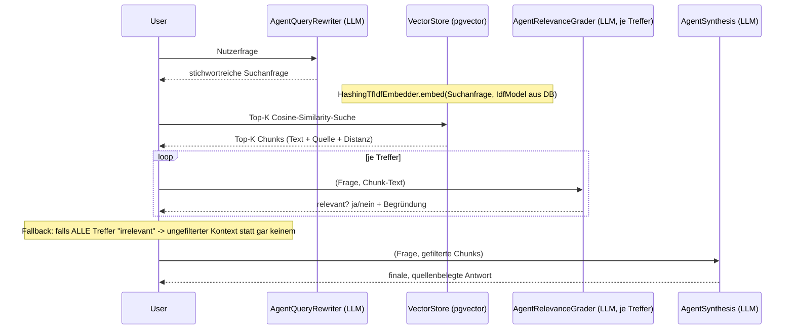

****# RAG-Lernbeispiel: PDFs, pgvector & eigene TF-IDF-Embeddings (Scala 3.9.0 / scala-cli)

Ziel: Verstehen, wie **Retrieval-Augmented Generation (RAG)** funktioniert - von der
PDF-Ingestion über eine echte Vektordatenbank (Postgres + pgvector) bis zur
mehrstufigen Agenten-Pipeline, die eine Nutzerfrage auf Basis lokaler Dokumente
beantwortet.

Aufgabe des Systems: Lokale PDF-Dateien (`docs/`) werden in Textchunks zerlegt,
mit selbstgebauten TF-IDF-Embeddings in eine pgvector-Datenbank geschrieben und
anschließend über eine dreistufige Agenten-Pipeline (Query-Rewriter ->
Relevance-Grader -> Synthesis) befragt.

## Tech-Stack

| Zweck                                                           | Bibliothek                                                                                |
|-----------------------------------------------------------------|-------------------------------------------------------------------------------------------|
| PDF -> Text                                                     | [Apache PDFBox](https://pdfbox.apache.org/) 3.x                                           |
| Chunking                                                        | eigene, simple Logik (`Chunking.scala`, feste Zeichenfenster mit Overlap)                 |
| Embeddings                                                      | eigene Implementierung (`HashingTfIdfEmbedder.scala`, Hashing-Trick + klassisches TF-IDF) |
| Vektordatenbank                                                 | [pgvector](https://github.com/pgvector/pgvector) auf Postgres 18 (`docker/sql-rag/`)      |
| DB-Zugriff                                                      | `org.postgresql:postgresql` (JDBC), reines SQL (kein ORM)                                 |
| Anthropic-/Claude-Client (Structured Output, einfache Requests) | [sttp-ai](https://sttp-ai.softwaremill.com/) (`claude`-Modul)                             |
| Dateisystemzugriff (`docs/`, `output/`)                         | [os-lib](https://github.com/com-lihaoyi/os-lib)                                           |
| Umgebungsvariablen                                               | `sys.env` direkt (keine eigene `.env`-Datei-Logik, siehe Abschnitt "Credentials")         |
| Tests (Chunking/TF-IDF-Mathe, ohne LLM-/DB-Call)                | [MUnit](https://scalameta.org/munit/) (`scala-cli test .`)                                |
| Build/Run ohne sbt-Projekt                                      | `scala-cli` mit `//> using`-Direktiven                                                    |

Keine sbt-`build.sbt` nötig - alle Abhängigkeiten werden per Direktive in
`project.scala` deklariert.

## Infrastruktur: eigener `postgres-rag`-Container

Dieses Projekt nutzt einen **eigenen**, vom restlichen `docker/docker-compose.yml`
getrennten Postgres-Container (Service `postgres-rag`), damit weder das
pgvector-Image noch das Ingestion-Schema die übrigen Lern-Datenbanken (`booksdb`, `magnumdb`, `myimdb`, ...) im
bestehenden `postgres`-Service
berühren:

|              | bestehender `postgres`-Service | `postgres-rag` (dieses Projekt) |
|--------------|--------------------------------|---------------------------------|
| Image        | `postgres:18-alpine`           | `pgvector/pgvector:pg18`        |
| Port (Host)  | 5433                           | **5434**                        |
| Datenbank    | mehrere (`booksdb`, ...)       | `ragdb`                         |
| Init-Skripte | `docker/sql/`                  | `docker/sql-rag/01-ragdb.sql`   |
| Volume       | `data`                         | `dataRag`                       |

Starten:

```bash
cd docker
docker compose up -d postgres-rag
```

`docker/sql-rag/01-ragdb.sql` legt beim ersten Start (leeres Volume) automatisch
an:

- die `vector`-Extension (`CREATE EXTENSION vector`),
- die Tabelle `document_chunks` (ein Chunk pro Zeile, inkl. `embedding vector(512)`),
- einen **HNSW**-Index auf `embedding` für Cosine-Similarity-Suche,
- die Tabelle `tfidf_model` (eine Zeile mit den bei der Ingestion gefitteten IDF-Gewichten).

### ivfflat vs. hnsw

pgvector bietet zwei Index-Typen für Vektorsuche an. Dieses Projekt nutzt bewusst **hnsw** statt des oft als Default
gezeigten **ivfflat**:

- `ivfflat` clustert die Vektoren vorab in `lists` Cluster und durchsucht bei
  einer Anfrage standardmäßig nur `probes = 1` davon - bei großen Datenmengen
  ein guter Geschwindigkeits-/Genauigkeits-Kompromiss, bei sehr kleinen
  Korpora (wie den 9 Chunks dieses Lernbeispiels) aber kontraproduktiv: Mit
  `lists = 10` auf 9 Zeilen enthält (statistisch) fast jedes Cluster nur eine
  einzige Zeile - ein `ORDER BY embedding <=> ? LIMIT k`-Query mit Index fand
  beim Entwickeln dieses Projekts dadurch reproduzierbar nur 2 von 9 Zeilen
  statt der erwarteten 5 (siehe Git-Historie/Entwicklungsprotokoll dieses
  Projekts) - kein eigener Bug, sondern exakt dieses bekannte pgvector-Verhalten.
- `hnsw` (Hierarchical Navigable Small World) braucht keine solche
  Vorab-"Trainingsphase" mit einer Mindestanzahl Zeilen und liefert auch bei
  sehr kleinen Datensätzen zuverlässig alle relevanten Treffer.

Für echte, große Produktions-Korpora bleibt `ivfflat` (richtig dimensioniert:
`lists ≈ sqrt(Zeilenanzahl)`, `probes` deutlich über 1) eine valide,
oft schnellere Alternative - für dieses Lernprojekt mit einer Handvoll
Beispiel-PDFs ist `hnsw` aber die robustere Wahl.

## Eigene Embeddings: Hashing-Trick + TF-IDF

Anthropic/Claude (das hier genutzte LLM) bietet **keine** Embedding-API - nur
Chat-/Completion-Funktionalität. Statt eines externen Embedding-Modells (z. B.
via Ollama oder einen zusätzlichen API-Provider) implementiert dieses Projekt
Embeddings bewusst selbst (`HashingTfIdfEmbedder.scala`), um den Mechanismus
ohne zusätzliche externe Abhängigkeit nachvollziehbar zu machen:

1. **Tokenisieren**: Text in Wörter zerlegen (einfache Regex-Trennung an
   Nicht-Buchstaben/-Zahlen, Kleinschreibung).
2. **Hashing-Trick** (siehe [Feature Hashing](https://en.wikipedia.org/wiki/Feature_hashing),
   bekannt aus `scikit-learn`s `HashingVectorizer`): Jedes Wort wird per
   `word.hashCode % dims` direkt auf einen von `dims = 512` festen "Buckets"
   abgebildet - **kein** explizites, mit der Korpusgröße wachsendes Vokabular
   nötig. Das ist hier aus zwei Gründen wichtig: pgvector-Spalten (`vector(512)`)
   verlangen eine feste Dimension, und es muss kein Vokabular (Wort -> Index) zusätzlich zur Query-Zeit synchron
   gehalten werden.
3. **TF-IDF-Gewichtung**: Termfrequenz (`Vorkommen im Chunk / Wortanzahl
   im Chunk`) mal inverse Dokumentfrequenz (`idf[bucket]`, einmalig über den
   gesamten Korpus gefittet, `HashingTfIdfEmbedder.fitIdf`) - seltene,
   charakteristische Wörter bekommen so mehr Gewicht als häufige, uninformative
   Wörter.
4. **L2-Normalisierung**: Der resultierende Vektor wird auf Länge 1 skaliert -
   macht die Cosine-Similarity-Suche in pgvector robust gegenüber
   unterschiedlich langen Texten.

**Wichtig:** Das bei der Ingestion gefittete `IdfModel` (Gewichte je Bucket)
wird in `tfidf_model` persistiert und beim Embedden der Nutzerfrage zur
Query-Zeit erneut geladen (`VectorStore.loadIdfModel`) - nur so landen
Ingestion- und Query-Vektoren im selben Vektorraum und sind überhaupt
vergleichbar. Ingestion und Retrieval MÜSSEN also immer mit demselben Modell
arbeiten; ein erneuter `ingest`-Lauf ersetzt `tfidf_model` komplett.

**Grenzen dieses Ansatzes (bewusst in Kauf genommen):** TF-IDF ist rein
lexikalisch (Wortabgleich) - es erkennt z. B. nicht, dass "Mondlandung" und
"Apollo-11-Mission" semantisch verwandt sind, wenn kein gemeinsames Wort
vorkommt. Echte Embedding-Modelle (z. B. `text-embedding-3-small`,
`nomic-embed-text`) erfassen solche Bedeutungsähnlichkeiten zusätzlich. Der
`AgentQueryRewriter` (siehe unten) kompensiert einen Teil dieser Schwäche,
indem er die Nutzerfrage um naheliegende Fachbegriffe/Synonyme erweitert, bevor
gesucht wird.

## Die RAG-Pipeline



Bewusst **kein** Orchestrator-Agent/Planner (im Unterschied zu
`ai-sttpai-agentic`): Die Reihenfolge dieser Schritte ist für jede Frage
dieselbe - ein fester Workflow, kein LLM entscheidet über den Kontrollfluss.
Eine Planning-Phase wäre hier reiner Overhead.

### Die drei Agenten

| Agent                  | Rolle                                                                                                                                                    | Technik                                             |
|------------------------|----------------------------------------------------------------------------------------------------------------------------------------------------------|-----------------------------------------------------|
| `AgentQueryRewriter`   | Formt die (ggf. umgangssprachliche) Nutzerfrage in eine stichwortreiche Suchanfrage um - kompensiert teilweise die rein lexikalische Schwäche von TF-IDF | einfacher Text-Request (`buildAgent`)               |
| `AgentRelevanceGrader` | Bewertet pro Treffer, ob er inhaltlich zur Frage passt, und filtert Rauschen/False-Positives der Vektorsuche heraus                                      | Structured Output (`buildStructuredAgent[Grading]`) |
| `AgentSynthesis`       | Erzeugt aus Frage + gefilterten Chunks die finale, quellenbelegte Antwort (Context Passing, Grounding)                                                   | einfacher Text-Request (`buildAgent`)               |

Alle drei nutzen denselben Requesty-Router/`vertex/claude-sonnet-5@eu` wie die
anderen `ai-sttpai-*`-Projekte (`AnthropicClient.scala`), hier aber bewusst
ohne Tool-Use-Loop/Interceptor-Stack für Usage-Tracking (siehe
`ai-sttpai-agentic/Interceptors.scala`) - jeder Agent macht hier nur einen
einzigen, kurzen Request pro Aufruf.

## Wichtige Begriffe / Terminologie

- **RAG (Retrieval-Augmented Generation)**: Ein LLM beantwortet Fragen nicht
  nur aus seinem Trainingswissen, sondern bekommt zusätzlich per Suche (Retrieval) gefundene, externe Textstellen als
  Kontext mitgegeben - reduziert
  Halluzinationen und ermöglicht Antworten zu Dokumenten, die dem Modell beim
  Training unbekannt waren.
- **Chunking**: Zerlegen eines langen Textes in kleinere, in sich
  abgeschlossene Abschnitte (siehe `Chunking.scala`) - ein einzelner
  Embedding-Vektor repräsentiert sonst zu viele unterschiedliche Themen auf
  einmal und wird dadurch unspezifisch.
- **Overlap**: Bewusste Character-Überlappung zwischen benachbarten Chunks,
  damit ein entscheidender Satz nicht exakt an einer Chunk-Grenze zerschnitten
  wird und dadurch in keinem Chunk mehr vollständig erkennbar ist.
- **Embedding**: Ein Text wird auf einen festdimensionalen, numerischen Vektor
  abgebildet - ähnliche Inhalte liegen im Vektorraum nah beieinander.
- **Feature Hashing / Hashing-Trick**: Wörter werden per Hash-Funktion direkt
  auf feste Vektor-Positionen ("Buckets") abgebildet, statt ein explizites,
  wachsendes Vokabular zu pflegen (siehe `HashingTfIdfEmbedder`).
- **TF-IDF (Term Frequency - Inverse Document Frequency)**: Klassisches,
  rein lexikalisches Gewichtungsverfahren - Wörter, die in einem Dokument
  häufig, im GESAMTEN Korpus aber selten vorkommen, bekommen ein hohes
  Gewicht (charakteristisch für genau dieses Dokument); Wörter, die überall
  vorkommen (z. B. Füllwörter), ein niedriges.
- **Cosine-Similarity / Cosine-Distanz**: Winkel zwischen zwei Vektoren als
  Ähnlichkeitsmaß, unabhängig von deren Länge - in pgvector der `<=>`-Operator (`0` = identisch, `2` = exakt
  entgegengesetzt bei normalisierten Vektoren).
- **Vektordatenbank**: Eine Datenbank, die neben klassischen Spalten auch
  Vektor-Spalten unterstützt und dafür spezialisierte Ähnlichkeits-Indizes (hier: pgvector mit HNSW) anbietet, um die
  nächsten Nachbarn eines
  Such-Vektors effizient zu finden, ohne jede Zeile einzeln vergleichen zu
  müssen (Approximate Nearest Neighbor Search).
- **HNSW (Hierarchical Navigable Small World)**: Ein Graph-basierter
  Ähnlichkeits-Index für Approximate Nearest Neighbor Search - im Gegensatz zu
  `ivfflat` ohne Mindestdatenmenge/"Trainingsphase" zuverlässig nutzbar (siehe
  Abschnitt "ivfflat vs. hnsw" oben).
- **Retrieval**: Das Suchen der zu einer Anfrage passendsten Chunks in der
  Vektordatenbank (`VectorStore.search`).
- **Query Rewriting**: Ein LLM formuliert die ursprüngliche Nutzerfrage vor dem
  Retrieval um (Synonyme/Fachbegriffe explizit machen), um die Trefferqualität
  der nachgelagerten Suche zu verbessern (`AgentQueryRewriter`).
- **Relevance Grading / Reranking**: Ein zusätzlicher, inhaltlicher
  LLM-Prüfschritt NACH der mathematischen Vektorsuche, der lexikalisch
  ähnliche, aber inhaltlich irrelevante Treffer aussortiert (`AgentRelevanceGrader`).
- **Context Passing**: Die Ausgabe eines Pipeline-Schritts (hier: gefilterte
  Chunk-Texte) wird als Teil des Prompts in den nächsten Schritt eingebettet.
- **Grounding**: Antworten eines Modells durch tatsächlich vorgelegten,
  verifizierbaren Text absichern statt sich nur auf internes Modellwissen zu
  verlassen - hier zusätzlich durch explizite Quellenangaben (Dateiname + Chunk-Nummer) im Antworttext sichtbar gemacht.
- **Structured Output**: Anthropics natives Feature, die komplette
  Modell-Antwort auf ein vorgegebenes JSON-Schema zu erzwingen - genutzt vom
  `AgentRelevanceGrader` (`Grading(relevant: Boolean, reasoning: String)`),
  analog zu `ExecutionPlan` in `ai-sttpai-agentic`.

## Projektstruktur

```
ai-rag-sttpai/
├── project.scala              # scala-cli Direktiven: Scala-Version, Abhängigkeiten, MUnit
├── docs/                      # generierte Beispiel-PDFs (siehe `generate-docs`)
├── AnthropicClient.scala      # ClaudeClient + SyncBackend, buildAgent/buildStructuredAgent
├── Interceptors.scala         # minimaler Logging-Interceptor (kein Usage-/Budget-Tracking nötig)
├── Db.scala                   # JDBC-Verbindungsaufbau zu postgres-rag/ragdb
├── PdfTextExtractor.scala     # PDFBox-Wrapper: PDF -> Roh-Text
├── Chunking.scala             # Text -> überlappende Chunks (reine Logik, getestet)
├── HashingTfIdfEmbedder.scala # Hashing-Trick + TF-IDF-Embeddings (reine Logik, getestet)
├── VectorStore.scala          # pgvector: Insert, IDF-Modell-Persistenz, Cosine-Similarity-Suche
├── Ingestion.scala            # verdrahtet: PDFs -> Chunks -> Embeddings -> VectorStore
├── AgentQueryRewriter.scala   # LLM-Agent: Frage -> Suchanfrage
├── AgentRelevanceGrader.scala # LLM-Agent (Structured Output): Chunk relevant? ja/nein
├── AgentSynthesis.scala       # LLM-Agent: finale, quellenbelegte Antwort
├── RagPipeline.scala          # verdrahtet die komplette Pipeline (siehe Sequenzdiagramm oben)
├── GenerateSampleDocs.scala   # erzeugt die Beispiel-PDFs in docs/ (PDFBox)
├── SampleDocs.scala           # Inhalte der Beispiel-PDFs (Photosynthese, Raumfahrt, Scala 3)
├── Main.scala                 # @main mit Subcommands: generate-docs / ingest / ask
├── test/                      # MUnit-Tests für Chunking/HashingTfIdfEmbedder (kein LLM-/DB-Call)
│   ├── ChunkingTest.test.scala
│   └── HashingTfIdfEmbedderTest.test.scala
├── output/                    # wird beim `ask`-Lauf erzeugt (answer.md)
└── README.md
```

## Ausführen

Voraussetzung: `postgres-rag`-Container läuft (siehe oben,
`docker compose up -d postgres-rag` im `docker/`-Ordner) sowie die
Umgebungsvariable `ANTHROPIC_AUTH_TOKEN` bzw. `ANTHROPIC_API_KEY` ist gesetzt
(Requesty-Key). Dieses Projekt liest Umgebungsvariablen direkt über `sys.env`
(keine eigene `.env`-Parser-Klasse, siehe Abschnitt "Credentials") - die
`.env`-Datei in diesem Projektordner wird stattdessen über
[direnv](https://direnv.net/) automatisch in echte Umgebungsvariablen geladen
(`.envrc` enthält dafür nur die eine Zeile `dotenv`, analog zu
`ai-rag-langchain4j`): einmalig `direnv allow` in diesem Ordner ausführen,
danach setzt direnv die Variablen beim Betreten des Ordners automatisch. Ohne
direnv funktioniert es genauso mit einem manuellen `export
ANTHROPIC_AUTH_TOKEN="rqsty-sk-..."`.

```bash
cd cli/ai-rag-sttpai

# 1. einmalig: Beispiel-PDFs erzeugen
scala-cli run . -- generate-docs

# 2. PDFs einlesen, chunken, embedden, in pgvector schreiben (bei Bedarf wiederholbar)
scala-cli run . -- ingest

# 3. Fragen stellen
scala-cli run . -- ask "Wann betraten die ersten Menschen den Mond und wer war dabei?"
scala-cli run . -- ask "Welches Schlüsselwort ersetzt implizite Werte in Scala 3?"

# Tests (reine Logik, kein API-/DB-Call nötig)
scala-cli test .
```

Die Antwort landet zusätzlich in `output/answer.md` (inkl. umformulierter
Suchanfrage und genutzter Quellen).

## Credentials

Der API-Key wird direkt aus der echten Umgebungsvariable
`ANTHROPIC_AUTH_TOKEN` (alternativ `ANTHROPIC_API_KEY`) gelesen
(`sys.env.get(...)`, siehe `AnthropicClient.scala`) und gegen den
Requesty-Router (`https://router.eu.requesty.ai`, Modell
`vertex/claude-sonnet-5@eu`) authentifiziert. Sind beide Variablen nicht
gesetzt, bricht der Zugriff mit einer klaren `RuntimeException` ab - bewusst
**keine** eigene `.env`-Parser-Klasse mehr (vormals `object Env`): Für ein
Lernbeispiel genügen vom Betriebssystem bereitgestellte Umgebungsvariablen;
eine zusätzliche Parser-Klasse dafür wäre nur zusätzlicher Code ohne
didaktischen Mehrwert (analog zu `ai-rag-langchain4j`, siehe dortiges
`LlmConfig.scala`/`PgConfig.scala`).

Die `.env`-Datei in diesem Ordner bleibt trotzdem bestehen - sie wird nur
nicht mehr von eigenem Scala-Code gelesen, sondern von
[direnv](https://direnv.net/) über `.envrc` (`dotenv`) automatisch in echte
Umgebungsvariablen umgewandelt, sobald man in diesen Ordner wechselt (einmalig
`direnv allow` nötig).

Die Postgres-Zugangsdaten (`postgres-rag`, Port 5434, DB `ragdb`) sind als
Dev-Defaults direkt in `Db.scala` hinterlegt (passend zu
`docker/docker-compose.yml`) und lassen sich bei Bedarf über `PGRAG_URL`,
`PGRAG_USER`, `PGRAG_PASSWORD` überschreiben (z. B. ebenfalls über dieselbe
`.env`-Datei).

## Stolpersteine

**1. `ivfflat`-Index übersieht Zeilen bei kleinen Korpora:** Siehe Abschnitt
"ivfflat vs. hnsw" oben - mit `lists = 10` auf nur 9 Beispiel-Chunks fand eine
`ORDER BY embedding <=> ? LIMIT 5`-Query nur 2 statt 5 Treffer. Gelöst durch
Wechsel auf einen `hnsw`-Index (`docker/sql-rag/01-ragdb.sql`).

**2. pg18+ verlangt einen Mount auf `/var/lib/postgresql` statt
`/var/lib/postgresql/data`:** Ab Postgres 18 erwarten die offiziellen
Docker-Images Daten in einem versionsspezifischen Unterverzeichnis (`pg_ctlcluster`-kompatibles Layout) und verweigern
den Start, wenn das alte
Volume-Layout (`/var/lib/postgresql/data`) direkt mit einem bestehenden Volume
gemountet wird. Siehe `docker-compose.yml`, Service `postgres-rag`:
`- dataRag:/var/lib/postgresql` (ohne `/data`-Suffix).

**3. `sqlite-vec` wäre keine automatisch auflösbare Abhängigkeit gewesen:**
Ursprünglich war eine rein dateibasierte SQLite+`sqlite-vec`-Lösung angedacht (keine Docker-Infrastruktur nötig) -
`sqlite-vec` liegt aber nicht als
Maven-Artefakt vor, sondern nur als plattformspezifische native Bibliothek (`vec0.so`/`.dll`/`.dylib`), die manuell
heruntergeladen und per
`load_extension` eingebunden werden müsste. Da im Projekt bereits eine
Postgres-Infrastruktur (`docker/docker-compose.yml`) vorhanden ist, fiel die
Wahl stattdessen auf einen eigenen `postgres-rag`-Container mit pgvector -
eine "echte", über Maven/JDBC normal ansprechbare Vektordatenbank ohne
zusätzliche native Abhängigkeiten.
