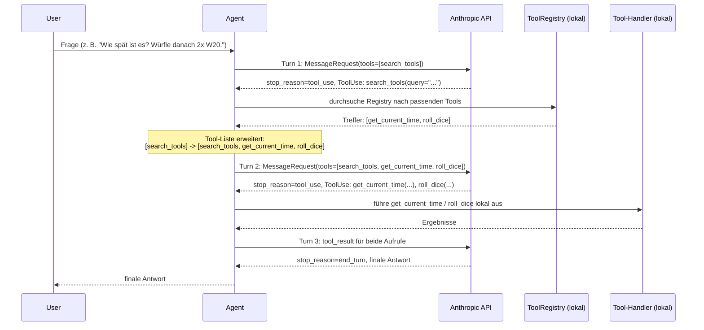

# Einfaches Agentensystem mit Tool-Search (Scala 3.9.0 / scala-cli)

Ziel: Verstehen, wie ein **einzelner Agent** (kein Multi-Agenten-System) mit dem
**Tool-Search-Paradigma** (auch "Progressive Tool Disclosure" genannt)
arbeitet - als Lernbeispiel neben `../ai-sttpai-manual` (dort: Multi-Agenten-
System mit statischer Tool-Liste).

## Was ist "Tool-Search"?

Im "klassischen" Ansatz (siehe `ai-sttpai-manual`) bekommt das Modell bei
**jedem** Request die kompletten JSON-Schemas **aller** verfügbaren Tools
mitgeschickt. Bei 3 Tools ist das kein Problem - aber echte Agentensysteme
haben teils hunderte Tools (interne APIs, Integrationen, ...). Alle Schemas
bei jedem Call mitzuschicken verbraucht unnötig Context-Budget und lenkt das
Modell unter Umständen sogar ab (zu viele irrelevante Optionen).

**Tool-Search** löst das so:

- Das Modell sieht anfangs **nur ein einziges Meta-Tool**: `search_tools`.
- Möchte das Modell etwas tun (z. B. "wie spät ist es"), ruft es zuerst
  `search_tools(query="aktuelle Uhrzeit")` auf.
- Ein lokaler Handler durchsucht eine **Tool-Registry** (hier: simple
  Keyword-Suche über Name/Description/Keywords der registrierten Tools) und
  gibt die Treffer (Name + Beschreibung) zurück.
- **Der entscheidende Schritt:** Die gefundenen Tools werden serverseitig (in
  unserem Client-Code) der `tools`-Liste für den **nächsten** Request
  hinzugefügt - das Modell "sieht" sie danach wie ganz normale, direkt
  aufrufbare Tools.
- Danach läuft ein normaler Tool-Use-Multi-Turn-Loop wie im Schwesterprojekt.

Dieses Lernprojekt hat bewusst nur 3 Tools - genug, um den Mechanismus zu
zeigen, auch wenn sich Tool-Search bei nur 3 Tools in der Praxis noch nicht
lohnen würde.

## Die 3 Tools

| Tool               | Zweck                                                          |
|---------------------|-----------------------------------------------------------------|
| `get_current_time`  | Aktuelles Datum/Uhrzeit für eine IANA-Zeitzone (Standard: UTC) |
| `calculator`        | Wertet einen einfachen arithmetischen Ausdruck aus             |
| `roll_dice`         | Würfelt `count`-mal einen Würfel mit `sides` Seiten            |

Implementiert (Definition + Handler) in `Tools.scala`. Registriert - inklusive
des Meta-Tools `search_tools` selbst - in `ToolCatalog.scala`.

## Der Tool-Search-Flow im Detail



Wichtige Punkte:

- `search_tools` ist selbst ein ganz normales client-seitiges Tool (genau wie
  `calculate_tco` im Schwesterprojekt) - mit EINEM Unterschied: Sein Handler
  liefert neben dem Ergebnistext auch eine Liste neu freizuschaltender Tools
  zurück (`ToolCallResult.enables` in `ToolCatalog.scala`). Diese
  Rückgabestruktur (`output`, `enables`) ist für ALLE Tools identisch - der
  `AnthropicClient` behandelt `search_tools` also NICHT als Sonderfall,
  sondern ruft für jeden `ToolUse`-Block einheitlich `ToolCatalog.find(name)`
  und dessen `handler` auf. Bei den drei fachlichen Tools ist `enables`
  einfach immer leer.
- Die Freischaltung passiert rein clientseitig in
  `AnthropicClient.chat`: Nach jedem Turn werden die `enables`-Listen aller
  Tool-Aufrufe dieses Turns eingesammelt und der `tools`-Liste des nächsten
  Requests hinzugefügt (dedupliziert via `distinctBy` - ruft das Modell
  `search_tools` mehrmals im selben Turn mit überlappenden Treffern auf,
  akzeptiert die API sonst keine doppelten Tool-Namen).
- Freigeschaltete Tools bleiben für den Rest der Konversation aktiv - einmal
  gefunden, muss ein Tool nicht erneut gesucht werden.
- Ruft das Modell ein Tool auf, das noch nicht freigeschaltet ist (sollte bei
  korrektem System-Prompt nicht passieren), bekommt es eine Fehlermeldung
  zurück, die es zu `search_tools` zurückverweist.

## Logging / den Flow live nachvollziehen

Jeder Schritt wird beim Ausführen auf der Konsole mitgeloggt (Präfix
`[Agent]`), u. a.:

- pro Turn: wie viele Nachrichten gesendet werden und welche Tools **aktuell
  aktiv** sind
- `stop_reason` und Content-Blöcke (`text`, `thinking`, `tool_use`) jeder
  Antwort
- bei `search_tools`-Aufrufen: die Query und die gefundenen Treffer
- bei Freischaltung: eine Zeile `## Tool-Liste erweitert: [...] -> [...]`
- bei echten Tool-Aufrufen: Eingabe und Ergebnis
- am Ende: die finale Antwort

Dadurch kann man beim Aufruf live verfolgen, wie der Agent zunächst nur
`search_tools` "kennt", dann schrittweise die passenden Werkzeuge entdeckt
und erst danach benutzt.

## Beispielaufruf

```bash
cd cli/ai-sttpai-agent-toolsearch
scala-cli run . -- "Wie spät ist es gerade in Europe/Berlin, und würfle danach zweimal einen 20-seitigen Würfel und addiere das Ergebnis?"
```

Tatsächliche (leicht gekürzte) Konsolenausgabe eines Testlaufs:

```
[Agent] ===== Model-Call gestartet (model=vertex/claude-sonnet-5@eu) - Startwerkzeug: nur 'search_tools' =====
[Agent]    user:    Wie spät ist es gerade in Europe/Berlin, und würfle danach zweimal einen 20-seitigen Würfel und addiere das Ergebnis?
[Agent] --- Turn 1: sende 1 Nachricht(en), aktive Tools=[search_tools] ---
[Agent] <- Turn 1 Antwort: stop_reason=tool_use
[Agent]    [tool_use]  name=search_tools input={"query":"aktuelle Uhrzeit ermitteln"}
[Agent]    [tool_use]  name=search_tools input={"query":"Würfel werfen 20-seitig"}
[Agent]    >> search_tools(query=aktuelle Uhrzeit ermitteln)
[Agent]    << Treffer: get_current_time
[Agent]    >> search_tools(query=Würfel werfen 20-seitig)
[Agent]    << Treffer: get_current_time, calculator, roll_dice
[Agent] ## Tool-Liste erweitert: [search_tools] -> [search_tools, calculator, roll_dice, get_current_time]
[Agent] --- Turn 2: sende 3 Nachricht(en), aktive Tools=[search_tools, calculator, roll_dice, get_current_time] ---
[Agent] <- Turn 2 Antwort: stop_reason=tool_use
[Agent]    [tool_use]  name=get_current_time input={"timezone":"Europe/Berlin"}
[Agent]    [tool_use]  name=roll_dice input={"count":2,"sides":20}
[Agent]    >> Tool-Aufruf get_current_time({"timezone":"Europe/Berlin"})
[Agent]    << Tool-Ergebnis get_current_time -> {"timezone":"Europe/Berlin","iso8601":"2026-09-30T12:53:47..."}
[Agent]    >> Tool-Aufruf roll_dice({"count":2,"sides":20})
[Agent]    << Tool-Ergebnis roll_dice -> {"sides":20,"count":2,"rolls":[7,7],"sum":14}
[Agent] --- Turn 3: sende 5 Nachricht(en), aktive Tools=[search_tools, calculator, roll_dice, get_current_time] ---
[Agent] <- Turn 3 Antwort: stop_reason=end_turn
[Agent]    [text]      **Aktuelle Zeit in Europe/Berlin:** 30.09.2026, 12:53 Uhr **Würfelwurf (2x W20):** 7 und 7 -> Summe: 14
[Agent] ===== Finale Antwort nach 3 Turn(s): ... =====

=== ANTWORT ===

**Aktuelle Zeit in Europe/Berlin:** 30.09.2026, 12:53 Uhr
**Würfelwurf (2x W20):** 7 und 7 -> Summe: 14
```

Man sieht klar die 3 Phasen: Turn 1 (nur `search_tools` sichtbar, zwei
parallele Suchanfragen), die Freischaltung, Turn 2 (jetzt echte Tool-Aufrufe
möglich) und Turn 3 (finale, tool-freie Antwort).

Ohne Argument wird eine Standardfrage verwendet. Das Ergebnis landet zusätzlich
in `output/answer.md`.

## Stolperstein: Unicode-Wortgrenzen bei der Registry-Suche

`ToolRegistry.search` zerlegt die Suchanfrage naiv per `\W+` (Regex) in
Wörter. Java/Scala behandeln `\W` standardmäßig NUR ASCII-basiert - Umlaute
wie "ü" gelten dann fälschlich als Worttrenner: `"Würfel"` würde zu `"w"` und
`"rfel"` zerlegt. Das einzelne Zeichen `"w"` matcht per Substring-Suche fast
überall zufällig und hätte dadurch ungewollt zusätzliche, eigentlich
irrelevante Tools freigeschaltet (in einem Testlauf wurde so `calculator`
freigeschaltet, obwohl nur nach Uhrzeit/Würfeln gesucht wurde) - die
Kern-Garantie "nur bei Bedarf in den Context" wäre dadurch unterlaufen worden.
Behoben über das `(?U)`-Regex-Flag (Unicode-bewusstes Wort-Matching) sowie
das Verwerfen von Termen mit weniger als 3 Zeichen.

## Wichtige Begriffe / Terminologie

- **Agent**: Eine Einheit, die einen LLM-Aufruf mit einer klar definierten
  Rolle (System-Prompt) kapselt. Hier: genau ein Agent, kein Orchestrator und
  keine Worker-Agenten nötig (Abgrenzung zu `ai-sttpai-manual`).
- **Tool Use / Function Calling**: Fähigkeit des Modells, während der
  Antwortgenerierung definierte externe Werkzeuge aufzurufen.
- **Tool-Search / Progressive Tool Disclosure**: Muster, bei dem das Modell
  Tools nicht von Anfang an vollständig sieht, sondern sie über ein
  Meta-Tool (hier `search_tools`) gezielt "entdecken" muss, bevor sie
  aufrufbar werden. Reduziert Context-Verbrauch bei großen Tool-Inventaren
  und kann die Tool-Auswahl-Genauigkeit des Modells verbessern (weniger
  irrelevante Optionen pro Request).
- **Tool-Registry**: Zentrale, lokale Liste aller tatsächlich verfügbaren
  (aber anfangs verborgenen) Tools inkl. Suchbegriffen, hier `ToolRegistry`.
- **Meta-Tool**: Ein Tool, dessen Zweck nicht die eigentliche Fachaufgabe
  ist, sondern die Steuerung des Agenten-Verhaltens selbst - hier
  `search_tools`, das weitere Tools freischaltet.
- **Tool-Freischaltung ("Enablement")**: Der clientseitige Schritt, bei dem
  gefundene Tool-Definitionen der `tools`-Liste zukünftiger Requests
  hinzugefügt werden (siehe `AnthropicClient.chat`).
- **`ToolUse` / `ToolResult` Block**: Wie im Schwesterprojekt - `ToolUse` =
  Aufrufwunsch des Modells, `ToolResult` = Antwort des Client darauf.
- **`ClaudeSyncClient` (sttp-ai)**: Der blockierende, hochsprachliche
  Claude-Client aus `sttp-ai`.
- **Structured Concurrency / `ox.timeout`**: Der Model-Call ist über
  `ox.timeout` (60s) abgesichert - läuft ein Request zu lange, wird er
  abgebrochen und eine `TimeoutException` geworfen, statt den Prozess
  unbegrenzt blockieren zu lassen. Anders als im Schwesterprojekt gibt es
  hier keine Parallelität zwischen mehreren Agenten (`ox.par`), da nur ein
  einziger Agent existiert.

## Projektstruktur

```
ai-sttpai-agent-toolsearch/
├── project.scala        # scala-cli Direktiven: Scala-Version & Abhängigkeiten
├── Env.scala             # Liest ANTHROPIC_API_KEY aus .env (via os-lib)
├── AnthropicClient.scala # Model-Call-Loop MIT dynamisch wachsender tools-Liste (generisch, kein Sonderfall für search_tools) + ox.timeout
├── ToolCatalog.scala     # RegisteredTool/ToolCallResult, ALLE Tools (inkl. search_tools) + Keyword-Suche - der einzige Ort, an dem Tool-Search passiert
├── Tools.scala           # Definition & Handler der 3 fachlichen Tools (get_current_time, calculator, roll_dice)
├── Agent.scala           # Der einzige Agent (System-Prompt + Einstieg in AnthropicClient.chat)
├── Main.scala            # Einstiegspunkt (@main), schreibt output/answer.md via os-lib
├── output/               # wird beim Ausführen erzeugt
└── README.md
```

## Ausführen

```bash
cd cli/ai-sttpai-agent-toolsearch
scala-cli run . -- "Deine Frage hier"
```

## Credentials

Wie im Schwesterprojekt: API-Key wird aus der `.env`-Datei im Projektordner
gelesen (`ANTHROPIC_API_KEY`, alternativ `ANTHROPIC_AUTH_TOKEN`), genutzt wird
der Requesty-Router (`https://router.eu.requesty.ai`) mit dem Modell
`vertex/claude-sonnet-5@eu`.

## Abgrenzung zu `ai-sttpai-manual`

| Aspekt              | `ai-sttpai-manual`                          | `ai-sttpai-agent-toolsearch`                     |
|---------------------|----------------------------------------------|---------------------------------------------------|
| Agenten             | 3 (Fact-Researcher, Risk-Analyst, Synthesis) | 1                                                   |
| Steuerung           | Orchestrator (Fan-out/Fan-in via `ox.par`)   | keine (direkter Aufruf)                            |
| Tool-Sichtbarkeit   | alle Tools sofort in jedem Request           | nur `search_tools` sichtbar, Rest wird "entdeckt"  |
| `ox`-Nutzung        | `ox.par` für Parallelität zwischen Agenten   | `ox.timeout` für Timeout-Absicherung eines Calls   |
