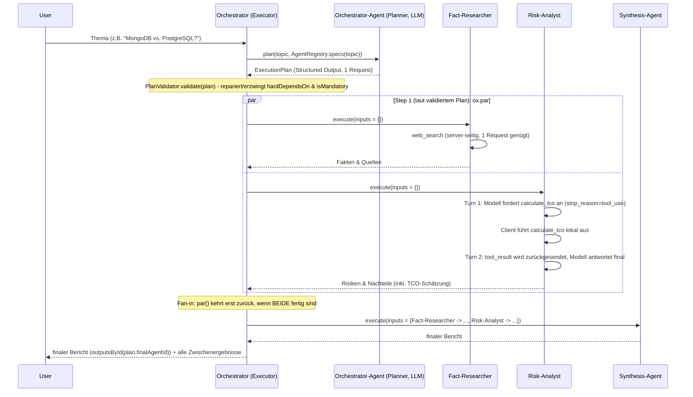
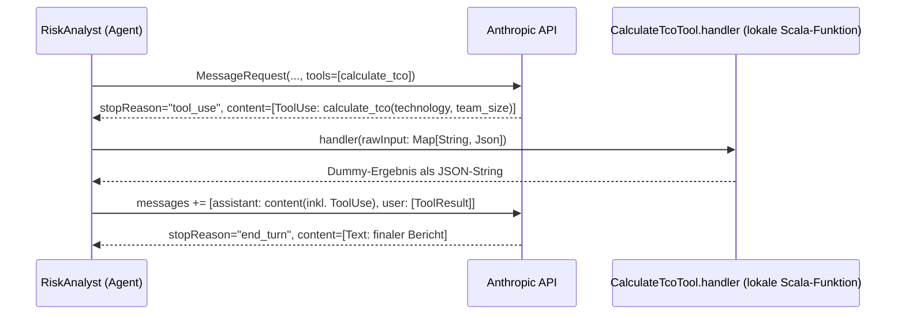

# Agentischer, generischer Multi-Agenten-Orchestrator (Scala 3.9.0 / scala-cli)

Ziel: Verstehen, wie ein Multi-Agenten-System funktioniert -
als Vorbereitung auf die **CCAF (Claude Code Agent Framework)**
Zertifizierung/Prüfung.

Aufgabe des Systems: Zu einer technischen Entscheidung (z. B. "MongoDB vs.
PostgreSQL") wird ein ausgewogener, faktenbasierter Entscheidungsbericht
erstellt.

**Besonderheit dieser Version:** Der Orchestrator ist kein hartcodierter
Workflow mehr, sondern zweigeteilt in eine *agentische* Planning-Phase (ein
LLM - der `AgentPlanner` - entscheidet selbst, welche Worker-Agenten
in welcher Reihenfolge/Parallelität laufen) und eine *generische*
Execution-Phase (ein Dependency-Graph-Executor, der weder Anzahl noch
Identität der Agenten kennt). Siehe Abschnitt
["Vom Workflow zum Agenten"](#vom-workflow-zum-agenten) für die Details.

## Tech-Stack

| Zweck                                                             | Bibliothek                                                                                        |
|-------------------------------------------------------------------|---------------------------------------------------------------------------------------------------|
| Anthropic-/Claude-Client (Messages API, Tools, Structured Output) | [sttp-ai](https://sttp-ai.softwaremill.com/) (`claude`-Modul, `ClaudeClient` + `Agent`-Loop)      |
| Interceptoren (Logging, Token-/Kosten-Tracking, Budgets)          | [sttp-ai](https://sttp-ai.softwaremill.com/agents/interceptors.html) `core`-Modul (`AgentInterceptor`, transitiv über `claude`) |
| JSON-Serialisierung/-Deserialisierung                             | [circe](https://circe.github.io/circe/) (bringt `sttp-ai` bereits mit, keine eigene Abhängigkeit) |
| JSON-Schema-Ableitung für Structured Output                       | [tapir](https://tapir.softwaremill.com/) `Schema` (bringt `sttp-ai` bereits mit)                  |
| Dateisystemzugriff (`output/`-Ordner)                             | [os-lib](https://github.com/com-lihaoyi/os-lib)                                                   |
| `.env`-Datei einlesen                                             | eigene, simple Implementierung (`object Env` in `AnthropicClient.scala`, siehe unten)             |
| Nebenläufigkeit (paralleles Ausführen der Worker)                 | [ox](https://ox.softwaremill.com/) (`par`, strukturierte Nebenläufigkeit auf Virtual Threads)     |
| Tests (Plan-Validierung/Executor-Logik, Interceptoren)            | [MUnit](https://scalameta.org/munit/) (`scala-cli test .`)                                        |
| Build/Run ohne sbt-Projekt                                        | `scala-cli` mit `//> using` Direktiven                                                            |

Keine sbt-`build.sbt` nötig - alle Abhängigkeiten werden per Direktive in
`project.scala` deklariert; `scala-cli` löst sie automatisch über Coursier
auf.

**Voraussetzung:** JDK 21+ (wird von `ox` für Virtual Threads benötigt).

## Vom Workflow zum Agenten

Die Vorgänger-Version dieses Projekts hatte einen rein hartcodierten
Ablauf: `AgentPlanner.scala` rief explizit `par(AgentFactResearcher.research(topic), 
AgentRiskAnalyst.analyze(topic))` gefolgt von `AgentSynthesis.synthesize(...)` auf -
ein fixer Code-Pfad, der weder wusste noch entscheiden konnte, *ob* ein
Agent für das konkrete Thema überhaupt sinnvoll ist. Das ist ein **Workflow**: die Steuerungslogik ist vorprogrammiert,
das LLM wird nur für
die einzelnen Agenten-Aufrufe selbst genutzt.

Diese Version verschiebt genau eine Entscheidung - "welche Agenten in
welcher Reihenfolge/Parallelität?" - vom Scala-Code in ein LLM. Das macht
den Orchestrator selbst zu einem **Agenten** (im Sinne von "ein LLM trifft
eine Kontrollfluss-Entscheidung", siehe Anthropics
["Building Effective Agents"](https://www.anthropic.com/research/building-effective-agents)),
zusätzlich zu den bereits vorhandenen Worker-Agenten.

Gleichzeitig wurde der Orchestrator **generisch** gemacht: Er kennt weder
die Anzahl noch die Identität der Agenten. Ein neuer Agent wird
eingebunden, indem lediglich eine neue `AgentSpec` in `AgentRegistry.specs`
ergänzt wird - weder `Orchestrator` (Execution) noch `AgentPlanner`
(Planning) müssen dafür angepasst werden.

## Die Agenten & die generische Registry

| Agent                            | Rolle                                                             | `hardDependsOn`               | `isMandatory` | Tools                                   |
|----------------------------------|--------------------------------------------------------------------|--------------------------------|:-------------:|-----------------------------------------|
| **Fact-Researcher** (Worker)     | Sammelt Argumente, Fakten und Quellen *für* eine Technologie      | -                             |     nein      | `web_search` (server-seitig)            |
| **Risk-Analyst** (Worker)        | Sucht gezielt Fallstricke, Kosten, Sicherheitsbedenken, Nachteile | -                             |     nein      | `calculate_tco` (client-seitig, custom) |
| **Synthesis-Agent** (Aggregator) | Liest beide Outputs, löst Widersprüche auf, erstellt Endbericht   | Fact-Researcher, Risk-Analyst |    **ja**     | -                                       |

**Wichtig zur `id`:** `AgentSpec.id` ist einfach der `name` des jeweiligen `Agent` (z. B. `"Fact-Researcher"`) - es gibt bewusst KEINE separate, zusätzliche id-Konstante mehr. Ein Agent hat damit
genau EINEN Bezeichner, der sowohl für Menschen (Logs, Dateinamen) als auch für den Planungs-Agent (LLM) und den `PlanValidator` (Set-Vergleiche in `hardDependsOn`) verwendet wird. Das spart
Duplikation, hat aber eine Konsequenz: Ändert sich `name`, ändert sich automatisch auch die `id` - und damit potenziell auch alle `hardDependsOn`-Referenzen darauf (siehe `AgentSynthesis.scala`,
`Set(AgentFactResearcher.name, AgentRiskAnalyst.name)`).

Jeder Agent registriert sich über eine `AgentSpec` (`AgentSpec.scala`) in
`AgentRegistry.specs` (`AgentRegistry.scala`) - einzig dort werden neue
Agenten eingetragen:

```scala
object AgentRegistry:
  def specs(topic: String): List[AgentSpec] = List(
    AgentFactResearcher.spec(topic),
    AgentRiskAnalyst.spec(topic),
    AgentSynthesis.spec(topic),
  )
```

`hardDependsOn` ist eine harte Constraint, die der `AgentPlanner`
(LLM) beim Planen einhalten MUSS (vom `PlanValidator` notfalls
erzwungen/repariert); `isMandatory` erzwingt, dass ein Agent immer im Plan
enthalten ist, selbst wenn das LLM ihn vergisst (typischerweise ein
Aggregator, ohne den kein sinnvolles Endergebnis entsteht). Nicht als
Pflicht markierte Agenten (hier: Fact-Researcher, Risk-Analyst) darf der
`AgentPlanner` bewusst weglassen, wenn er sie für ein konkretes Thema
für irrelevant hält.

Ein Orchestrator koordiniert den Ablauf in zwei Phasen (Planning via LLM,
Execution generisch) - siehe unten.

## Ablaufdiagramm (Sequenz)



## Architektur / Datenfluss

```mermaid
flowchart TD
    A[Main.scala] --> B[Orchestrator]
    B -->|1 . Planning| P[AgentPlanner]
    P -->|Structured Output| V[PlanValidator]
    V -->|validierter ExecutionPlan| B
    B -->|2 . Execution: Level-für-Level, ox . par pro Level| REG[AgentRegistry / AgentSpec]
    REG --> C[FactResearcher]
    REG --> D[RiskAnalyst]
    REG --> E[SynthesisAgent]
    C -->|nutzt Tool| C1[(web_search, server-seitig)]
    D -->|nutzt Tool| D1[(calculate_tco, client-seitig)]
    C -->|Ergebnis: Fakten| E
    D -->|Ergebnis: Risiken| E
    E -->|kein Tool, nur Kontext| F[Finaler Bericht]
    F --> G[output/*.md]

    subgraph Infrastruktur
        H[AnthropicClient] -. ClaudeClient + SyncBackend .-> I[(Anthropic API / Router)]
        H -. baut .-> AG[sttp-ai Agent-Loop + Interceptoren]
        AG -. Logging/Usage/Budget .-> INT[Interceptors.scala]
        H -. circe + tapir .-> J[JSON De/Serialisierung + Structured-Output-Schema]
    end
    C -.-> H
    D -.-> H
    E -.-> H
    P -.-> H
```



## Interceptoren: Logging, Usage-Tracking, Budget

sttp-ai bringt für den generischen Agent-Loop (`sttp.ai.core.agent.Agent`,
erzeugt via `AgentBuilder`) das Konzept der **Interceptoren**
(`AgentInterceptor`) mit - Middleware, die sich onion-style um jede
Iteration, jeden LLM-Call und jeden Tool-Aufruf legt (siehe
[sttp-ai-Doku](https://sttp-ai.softwaremill.com/agents/interceptors.html)).
Dieses Projekt nutzt sie für genau die Dinge, die für ein Lernprojekt
rund um Kosten/Tokenverbrauch interessant sind:

| Interceptor                                          | Zweck                                                                                                     |
|-------------------------------------------------------|-------------------------------------------------------------------------------------------------------------|
| `LoggingInterceptor` (sttp-ai)                       | Ersetzt das frühere handgeschriebene `[LLM:<Aufrufer>] ...`-Logging (`Interceptors.loggingFor`).            |
| `UsageTrackingInterceptor` (dieses Projekt)          | Schreibt Tokens/Modell/Dauer jedes LLM-Calls in einen pipeline-weiten `UsageCollector`.                     |
| `BudgetInterceptor` (sttp-ai)                        | Generöses Token-Limit pro Agent-Aufruf (`Interceptors.Pricing.perCallTokenBudget`) als Sicherheitsnetz.     |

Jeder Agent (inkl. `AgentPlanner`) bekommt diesen Interceptor-Stack über
`AnthropicClient.buildAgent`/`buildStructuredAgent` mit - siehe
`Interceptors.commonInterceptors`. Am Ende einer Pipeline liest der
`Orchestrator` aus dem geteilten `AnthropicClient.usageCollector` einen
Gesamt-Report (Tokens, geschätzte Kosten, Dauer je Agent + Planner), der
sowohl auf der Konsole ausgegeben als auch nach
`output/99_usage_report.md` geschrieben wird.

**Warum ein eigenes `AgentBackend` statt der eingebauten `ClaudeAgent`-Fabrik
von sttp-ai?** NICHT weil server- und client-seitige Tools sich auf HTTP-/JSON-Ebene
grundsätzlich unterscheiden würden - in der Messages API landen beide schlicht
als Einträge im selben `tools`-Array. Der eigentliche Grund liegt konkret im
sttp-ai-Code: `sttp.ai.claude.models.Tool` ist ein Sum-Type mit unterschiedlichen
Shapes (`Tool.WebSearch` hat z. B. gar kein `inputSchema`-Feld, sondern eigene
Felder wie `maxUses`/`allowedDomains` und einen eigenen Wire-Typ), und die
eingebaute, `private[claude]` `ClaudeAgentBackend.convertTool` bildet JEDES
registrierte `AgentTool[F, _]` unconditional auf `Tool.CustomRaw` ab - ohne
Zweig, der stattdessen `Tool.WebSearch` erzeugen könnte. `AgentTool[F, T]`
selbst zwingt außerdem zu einem JSON-Schema UND einer lokal auszuführenden
Funktion (`execute: T => F[String]`); `web_search` hat keins von beidem (kein
Schema nötig, keine lokale Ausführung, da der Server das Tool komplett selbst
auflöst und wir dafür nie einen `ToolCall` bekommen). `web_search` passt also
schlicht nicht in die `AgentTool`-Abstraktion, und die eingebaute Fabrik bietet
keinen anderen Erweiterungspunkt an. `AgentBackend[F]` ist aber ein öffentliches
sttp-ai-Trait; `ClaudeToolLoopBackend` (`AgentBackends.scala`) implementiert es
selbst und streut `Tool.WebSearch.default` direkt (nicht über `AgentTool`) in
die Tool-Liste ein - der Interceptor-Mechanismus selbst
(`LoopAgent.aroundLlmCall(...)`) ist davon unabhängig und funktioniert für
alle Agenten gleich, unabhängig davon, welches Tool sie nutzen.

**Kosten sind Schätzwerte:** `Interceptors.Pricing.table` enthält
öffentliche, ungefähre Anthropic-Listenpreise - keine verbindlichen Preise
des hier genutzten Requesty-Routers, der abweichend abrechnen und eine
andere `model`-Id zurückmelden kann als die in `sttp.ai.claude.models.ClaudeModel`
gelisteten. Taucht im Usage-Report ein "kein Preiseintrag für Modell..."-
Hinweis auf, sollte `Interceptors.Pricing` um die tatsächlich gemeldete
Modell-Id ergänzt werden.

## Client-seitiges Tool: der Tool-Use-Loop im Detail

Während `web_search` komplett vom Anthropic-Server ausgeführt wird (ein
einziger Request genügt), muss ein **client-seitiges (custom) Tool** wie
`calculate_tco` von uns selbst ausgeführt werden. Das erzeugt einen
Mehrschritt-Dialog ("Multi-Turn"). Diesen Loop übernimmt seit der
Umstellung auf sttp-ai-Interceptoren nicht mehr eine eigene, handgeschriebene
Methode, sondern der generische Agent-Loop von sttp-ai
(`sttp.ai.core.agent.LoopAgent`, erzeugt über `AnthropicClient.buildAgent`
und das projekteigene `ClaudeToolLoopBackend`, siehe `AgentBackends.scala`):
ein reiner `web_search`-Call terminiert die Schleife bereits nach dem
ersten Turn (keine `ToolCall`s in der Antwort), ein Custom-Tool wie
`calculate_tco` löst hingegen den Multi-Turn-Loop aus:



Wichtige Punkte:

- Das Tool wird per **JSON-Schema** (`sttp.apispec.Schema`, siehe
  `CalculateTcoTool.agentTool`) definiert und als
  `sttp.ai.core.agent.AgentTool` an den Agent-Loop übergeben - das Modell
  entscheidet selbst, *ob* und *mit welchen Parametern* es aufgerufen wird.
- `sttp-ai` bildet Anthropic's `content`-Feld bereits als typisiertes
  ADT (`sealed trait ContentBlock` mit `Text`, `ToolUse`, `ToolResult`, ...)
  ab - ein eigener `RawJson`-Wrapper wie in der Vorgänger-Implementierung
  entfällt dadurch vollständig.
- Die Original-Antwort des Modells (inkl. `ToolUse`-Block) muss als
  `assistant`-Nachricht unverändert in die Historie zurück, damit das
  Modell im nächsten Turn weiß, worauf sich das `ToolResult` bezieht - das
  übernimmt `ClaudeToolLoopBackend`/`LoopAgent` automatisch (siehe
  aber Stolperstein zu `Thinking`-Blöcken unten).
- Das `ToolResult` wird über die `toolUseId` dem passenden Aufruf
  zugeordnet.
- Die Schleife (`sttp.ai.core.agent.LoopAgent`) läuft so lange, bis eine
  Antwort ohne Tool-Aufrufe zurückkommt (oder ein Interceptor/die
  `maxIterations`-Grenze den Loop vorzeitig, aber geordnet beendet).

**Hinweis zur Kombination von Tool-Typen:** Mischt man in einer Anfrage
server-seitige (`web_search`) und client-seitige Tools, erwartet dieser
Router-Endpunkt für **beide** Typen ein `tool_result` - `web_search`
verhält sich in dieser Kombination NICHT wie ein automatisch aufgelöstes
Server-Tool, sondern wie ein ganz normales `ContentBlock.ToolUse`, das wir
selbst beantworten müssten. Das können wir aber nicht, da uns keine eigene
Websuch-Implementierung zur Verfügung steht (das wurde per Smoke-Test
verifiziert: das Modell fordert `web_search` per `ToolUse` an, wir können
nur mit "kein Handler registriert" antworten - die Suche findet dann de
facto nicht statt). Anders als die frühere, handgeschriebene `chat`-Methode
erzwingt `ClaudeToolLoopBackend` diesen Ausschluss nicht mehr per `require`
(`includeWebSearch` und `clientTools` sind dort technisch unabhängig
kombinierbar) - die Router-Einschränkung selbst besteht aber unverändert
fort. Deshalb nutzt der Risk-Analyst in diesem Beispiel weiterhin bewusst
ausschließlich `calculate_tco`, um den Ablauf klar isoliert zu zeigen.


## Planning-Phase: Der Orchestrator-Agent

Der `AgentPlanner` (`AgentPlanner.scala`) bekommt das Thema sowie
den Katalog aller `AgentSpec`s (id, Beschreibung, `hardDependsOn`,
`isMandatory`) als System-Prompt-Kontext und liefert einen `ExecutionPlan`
zurück:

```scala
case class ExecutionPlan(steps: List[List[String]], finalAgentId: String, reasoning: String)
```

Technisch genutzt wird Anthropics natives **Structured Output**
(`output_config`/`json_schema`), NICHT Tool-Use:

```scala
def buildStructuredAgent[T: {Schema, Codec}](caller: String, model: String, systemPrompt: String): Agent[Identity, String, T] =
  AgentBuilder[Identity, ClaudeModel.CustomClaudeModel](cfg => ClaudeToolLoopBackend(client, model, includeWebSearch = false, cfg))
    .systemPrompt(systemPrompt)
    .interceptors(commonInterceptors(caller))
    .deriveResponseSchema[T]
    .build
```

`sttp-ai` leitet das JSON-Schema automatisch aus der Case-Class `T` ab (via `tapir.Schema`, `derives Schema`) und parst
die Antwort direkt zu `T`
(`circe.Codec`, `derives Codec` - ein bidirektionaler Codec ist Voraussetzung für `deriveResponseSchema`, auch wenn hier
nur decodiert wird). Der entscheidende Unterschied zu
Tool-Use (siehe oben, `AgentRiskAnalyst`/`calculate_tco`): Bei Tool-Use KANN
das Modell trotz Tool-Definition mit einem reinen Text-Turn antworten (`stopReason != "tool_use"`) - Structured Output
erzwingt dagegen auf
API-Ebene, dass die GESAMTE Antwort exakt dem Schema entspricht. Ein
Multi-Turn-Loop ist daher nicht nötig, ein
einzelner Request genügt (siehe `AnthropicClient.buildStructuredAgent`, genutzt von `AgentPlanner.plan`).

**Warum das trotzdem validiert werden muss:** Ein LLM-Aufruf ist nie
hundertprozentig verlässlich - selbst mit erzwungenem Schema kann der *Inhalt* des Plans falsch sein (unbekannte
agent-ids, verletzte
`hardDependsOn`-Abhängigkeiten, vergessene `isMandatory`-Agenten, ungültige
`finalAgentId`). Deshalb läuft jeder rohe Plan vor der Ausführung durch
`PlanValidator.validate` (`PlanValidator.scala`):

1. Unbekannte/doppelte agent-ids werden entfernt.
1. Fehlende Pflicht-Agenten (`isMandatory`) werden ergänzt.
1. Die verbleibende Reihenfolge dient nur noch als Tie-Breaker für einen
   stabilen topologischen Sort (Kahn-Algorithmus) nach `hardDependsOn` -
   das garantiert dependency-korrekte Level-Gruppierung, unabhängig davon,
   wie (in)korrekt das LLM ursprünglich gruppiert hatte. Ein Zyklus wird
   defensiv aufgebrochen statt den Executor zu blockieren.
1. `finalAgentId` wird validiert, sonst auf einen Pflicht-Agenten
   zurückgefallen.

`PlanValidator` ist reine, LLM-freie Logik und wird entsprechend mit MUnit
getestet (`PlanValidatorTest.test.scala`, `scala-cli test .`) - unabhängig
davon, wie zuverlässig das LLM tatsächlich antwortet.

## Execution-Phase: generischer Dependency-Graph-Executor

Der validierte Plan besteht aus Steps (`List[List[String]]`). Alle
agent-ids innerhalb eines Steps sind laut Plan unabhängig voneinander und
werden per `ox.par` parallel ausgeführt; der nächste Step startet erst,
wenn der aktuelle vollständig abgeschlossen ist:

```scala
var outputs = ListMap.empty[String, String]
for step <- plan.steps do
  val results = par(step.map(id => () => specs(id).execute(outputs)))
  outputs = outputs ++ step.zip(results)
```

`Orchestrator.scala` kennt an dieser Stelle weder die Anzahl noch die
Identität der Agenten - er iteriert ausschließlich über das, was
`AgentRegistry` bereitstellt und `AgentPlanner`/`PlanValidator`
geplant haben. Fact-Researcher und Risk-Analyst laufen (wie in der
Vorgänger-Version) weiterhin automatisch parallel, Synthesis automatisch
danach - aber ohne dass irgendwo im Code `par(FactResearcher..., RiskAnalyst...)`
hartcodiert steht.

## Warum parallel?

Fact-Researcher und Risk-Analyst sind voneinander **unabhängig**: keiner
braucht das Zwischenergebnis des anderen, um seine eigene Aufgabe zu lösen (kein gemeinsamer Eintrag in
`hardDependsOn`). Solche Worker lassen sich
parallelisieren (**Fan-out**), was die Gesamtlaufzeit deutlich reduziert -
denn die längste Wartezeit für ein Modell (Latenz) tritt nur einmal auf,
statt sich zu addieren. Erst der Synthesis-Agent braucht *beide* Ergebnisse
gleichzeitig (**Fan-in** / Synchronisationspunkt), läuft daher
zwangsläufig in einem eigenen, späteren Step.

Im Code (`Orchestrator.scala`) wird das mit [ox](https://ox.softwaremill.com/)
umgesetzt: `par(step.map(id => () => specs(id).execute(outputs)))` startet
alle Agenten EINES Steps auf eigenen Virtual Threads und kehrt erst
zurück, wenn ALLE fertig sind - Fan-out und Fan-in in einem einzigen
Aufruf, jetzt aber generisch für eine beliebige Anzahl von Agenten (`Seq[() => T]` statt der ursprünglichen festen
2er-Tupel-Variante von
`par`). Im Gegensatz zu `scala.concurrent.Future` handelt es sich dabei um **strukturierte Nebenläufigkeit**: Der Scope
von `par` garantiert, dass
keine "verwaisten" Hintergrund-Threads übrig bleiben, und schlägt eine der
beiden Berechnungen fehl, wird die andere automatisch abgebrochen (interrupted) und der Fehler propagiert - ganz ohne
manuelles
Error-Handling für beide Zweige einzeln.

## Wichtige Begriffe / Terminologie (für die CCAF-Prüfung)

- **Agent**: Eine Einheit, die einen LLM-Aufruf mit einer klar definierten
  Rolle (System-Prompt) kapselt und eine abgegrenzte Teilaufgabe löst. Hier
  als `abstract class Agent` in `Agent.scala` modelliert.
- **System Prompt**: Instruktion, die dem Modell *vor* der eigentlichen
  Nutzeranfrage mitgegeben wird und Rolle, Verhalten und Einschränkungen des
  Agenten festlegt (hier z. B. "Du bist der Fact-Researcher... nenne KEINE
  Risiken").
- **Multi-Agenten-System (Multi-Agent System, MAS)**: Mehrere spezialisierte
  Agenten arbeiten zusammen, um eine Aufgabe zu lösen, die ein einzelner
  Agent schlechter oder weniger strukturiert lösen würde (Separation of
  Concerns).
- **Worker Agent**: Ein Agent, der eine Teilaufgabe eigenständig bearbeitet,
  meist ohne Kenntnis der Zwischenergebnisse anderer Worker. Sorgt für
  unabhängige, unvoreingenommene Perspektiven (Fact-Researcher und
  Risk-Analyst kennen sich gegenseitig nicht).
- **Orchestrator**: In dieser Version zweigeteilt: Der **Orchestrator-Agent**
  (`AgentPlanner.scala`, LLM-Call) entscheidet *welche* Agenten *wann*
  (sequentiell oder parallel) aufgerufen werden sollen (Planning); der
  eigentliche `Orchestrator` (`Orchestrator.scala`) führt diesen Plan nur
  noch generisch aus (Execution) - er selbst ist reiner Code, kein
  LLM-Call. Diese Trennung ist der Kernunterschied zwischen einem
  hartcodierten **Workflow** (Vorgänger-Version) und einem **Agenten** als
  Kontrollfluss-Entscheider.
- **`AgentSpec` / `AgentRegistry`**: Generische, LLM-unabhängige
  Beschreibung eines Agenten (id, Beschreibung, `hardDependsOn`,
  `isMandatory`, `execute`-Funktion), zentral gesammelt in
  `AgentRegistry.specs`. Macht den Orchestrator generisch erweiterbar:
  neue Agenten werden nur hier ergänzt, ohne Executor oder Planner
  anzufassen.
- **`ExecutionPlan` / `PlanValidator`**: Der vom Orchestrator-Agent
  gelieferte Plan (Liste von parallel ausführbaren Steps + `finalAgentId`)
  ist LLM-generiert und daher nicht blind vertrauenswürdig.
  `PlanValidator.validate` erzwingt strukturelle Korrektheit (bekannte
  ids, eingehaltene `hardDependsOn`-Constraints via topologischem Sort,
  vorhandene Pflicht-Agenten, gültige `finalAgentId`) unabhängig von der
  Zuverlässigkeit der LLM-Antwort - und ist dadurch, im Gegensatz zum
  Rest des Systems, ohne echten Model-Call testbar (`scala-cli test .`).
- **Structured Output**: Anthropics natives Feature, die komplette
  Modell-Antwort auf ein vorgegebenes JSON-Schema zu erzwingen (`output_config`/`json_schema` in der Messages API). In
  `sttp-ai`
  abgebildet über `AgentBuilder.deriveResponseSchema[T]`
  (`AnthropicClient.buildStructuredAgent`) - das Schema wird automatisch aus
  einer Scala-Case-Class abgeleitet (`derives Schema` via tapir), die
  Antwort direkt zu dieser Case-Class geparst (`derives Codec` via
  circe). Im Unterschied zu Tool-Use genügt dafür immer ein einzelner
  Request (kein `tool_use`/`tool_result`-Umweg), da das Modell gar nicht
  anders antworten kann als schemakonform. Genutzt vom
  `AgentPlanner` für den `ExecutionPlan`.
- **DAG (Directed Acyclic Graph) / Dependency-Graph-Executor**: Der
  generische `Orchestrator` interpretiert die `hardDependsOn`-Beziehungen
  der `AgentSpec`s als gerichteten, azyklischen Graphen und führt ihn
  Level-für-Level aus (`plan.steps`) - alle voneinander unabhängigen
  Agenten eines Levels parallel (`ox.par`), Level für Level sequentiell.
  Ersetzt das starre, hartcodierte Fan-out/Fan-in der Vorgänger-Version.
- **Synthesis- / Aggregator-Agent**: Ein Agent, der die Ausgaben mehrerer
  Worker als Kontext bekommt und daraus ein konsolidiertes Ergebnis
  erzeugt. Löst dabei auch inhaltliche Widersprüche zwischen den
  Worker-Ergebnissen auf.
- **Fan-out / Fan-in**: Verteilungsmuster, bei dem eine Aufgabe an mehrere
  unabhängige Worker verteilt wird (Fan-out) und deren Ergebnisse später an
  einer Stelle zusammengeführt werden (Fan-in). In Scala umgesetzt über
  `ox.par(...)`, das beide Berechnungen parallel startet und blockiert, bis
  beide Ergebnisse vorliegen.
- **Strukturierte Nebenläufigkeit (Structured Concurrency)**: Ein
  Nebenläufigkeits-Modell, bei dem der "Scope" einer parallelen Operation (hier: `par`) exakt an den Lebenszyklus des
  aufrufenden Codes gebunden
  ist - alle gestarteten Threads sind entweder erfolgreich beendet, oder
  wurden abgebrochen, BEVOR der umgebende Aufruf zurückkehrt. Verhindert
  "verwaiste" Hintergunds-Threads, wie sie bei freischwebenden `Future`s
  entstehen können. `ox` implementiert dies auf Basis von Java Virtual
  Threads (JDK 21+).
- **Tool Use / Function Calling**: Die Fähigkeit eines Modells, während der
  Antwortgenerierung definierte externe Werkzeuge aufzurufen, um an
  Informationen zu gelangen oder Aktionen auszuführen, die nicht im
  Trainingswissen enthalten sind (Grounding) bzw. nicht direkt im Modell
  ausgeführt werden können. Man unterscheidet:
- **Server-seitiges Tool**: Ein Tool wie `web_search_20250305`, das direkt
  vom Anthropic-Server ausgeführt wird - der Client muss den Tool-Aufruf
  nicht selbst abfangen und beantworten. Ein einzelner Request genügt (`ClaudeToolLoopBackend`, siehe `AgentBackends.scala`).
- **Client-seitiges (custom) Tool**: Ein selbst definiertes Tool (z. B.
  `calculate_tco` beim Risk-Analyst), an den Agent-Loop übergeben als
  `sttp.ai.core.agent.AgentTool` (`CalculateTcoTool.agentTool`). Das Modell liefert nur den *Wunsch*, das
  Tool
  aufzurufen (`ToolCall` in der `AgentResponse`), zurück - die eigentliche
  Ausführung übernimmt eine lokale Handler-Funktion (`CalculateTcoTool.handler`). Das Ergebnis muss danach explizit als
  `ContentBlock.ToolResult` an das Modell zurückgesendet werden (Multi-Turn-Dialog,
  vom generischen `sttp.ai.core.agent.LoopAgent` übernommen).
- **Tool-Handler**: Die lokale Funktion, die ein client-seitiges Tool
  tatsächlich ausführt (hier: `CalculateTcoTool.handler`, genutzt von
  `CalculateTcoTool.agentTool` in `AgentRiskAnalyst.scala`). Bekommt die vom Modell gewählten Parameter als
  `Map[String, io.circe.Json]` und liefert einen String (meist JSON) als Ergebnis zurück.
- **Interceptor** (`sttp.ai.core.agent.AgentInterceptor`): Middleware um
  den Agent-Loop, die onion-style Iterationen/LLM-Calls/Tool-Aufrufe
  umschließt (siehe Abschnitt "Interceptoren" oben) - genutzt für Logging
  (`LoggingInterceptor`), Token-/Kosten-Tracking (`UsageTrackingInterceptor`,
  dieses Projekt) und Budgets (`BudgetInterceptor`).
- **`ToolUse` / `ToolResult` Block**: Content-Block-Typen im
  Anthropic-Message-Format (in `sttp-ai` als `ContentBlock.ToolUse` /
  `ContentBlock.ToolResult` modelliert). `ToolUse` = Aufrufwunsch des
  Modells (Name + Parameter + eindeutige `id`); `ToolResult` = die Antwort
  des Client darauf, referenziert über `toolUseId`.
- **Grounding**: Antworten eines Modells durch externe, verifizierbare
  Quellen (z. B. Websuche-Ergebnisse) absichern, statt sich nur auf
  internes Modellwissen zu verlassen.
- **Context Passing**: Das Weiterreichen der Ausgabe eines Agenten als
  Eingabe-Kontext für einen anderen Agenten (hier: Fakten + Risiken werden
  als Text in den Prompt des Synthesis-Agent eingebettet).
- **Content Block**: Die Antwort eines Anthropic-Modells besteht aus einer
  Liste von Content-Blöcken unterschiedlichen Typs (`Text`, `ServerToolUse`,
  `WebSearchToolResult`, ...), in `sttp-ai` als `sealed trait ContentBlock`
  mit Fallklassen abgebildet. Für den finalen Bericht werden nur die
  `Text`-Blöcke extrahiert (`ClaudeToolLoopBackend.sendRequest`, siehe `AgentBackends.scala`).
- **Codec (circe)**: Typklassen-basierte Serialisierungs-/
  Deserialisierungslogik für einen bestimmten Typ (`Codec[T]` bzw.
  `Codec.AsObject[T]`), von `sttp-ai` selbst für alle API-Modelle
  bereitgestellt bzw. per `derives Codec.AsObject` für eigene Typen (`CalculateTcoInput`/`CalculateTcoResult` in
  `CalculateTcoTool.scala`)
  ableitbar.
- **`ClaudeClient` / `SyncBackend` (sttp-ai)**: `ClaudeClient` baut Requests
  gegen die Anthropic Messages API nur noch (stateless, gibt `Either`
  zurück); das eigentliche Senden übernimmt ein separat gehaltener
  `sttp.client4.SyncBackend` (`AnthropicClient.backend`, gewrappt in
  `RetryingBackend` für automatische Retries bei transienten Fehlern). Diese
  Trennung ist Voraussetzung dafür, dass der Interceptor-fähige Agent-Loop
  (`Agent.run(in)(backend)`) den Backend explizit entgegennehmen kann - die
  bequemere, aber dafür ungeeignete Alternative `ClaudeSyncClient` versteckt
  den Backend intern.
- **Virtual Thread**: Ein von der JVM (ab JDK 21) verwalteter, extrem
  leichtgewichtiger Thread. Im Gegensatz zu klassischen Plattform-Threads
  können davon Millionen gleichzeitig existieren, ohne dass jeder ein
  eigenes Betriebssystem-Thread belegt. `ox` nutzt Virtual Threads als
  Grundlage für `par`, `fork` & Co.

## Projektstruktur

```
multi-agent-agentic-orchestrator/
├── project.scala             # scala-cli Direktiven: Scala-Version, Abhängigkeiten & Test-Framework (MUnit)
├── AnthropicClient.scala     # ClaudeClient + SyncBackend, buildAgent/buildStructuredAgent (Interceptor-Stack), usageCollector
│                             #   + object Env am Dateiende: liest ANTHROPIC_AUTH_TOKEN/ANTHROPIC_API_KEY aus .env (via os-lib)
├── AgentBackends.scala       # ClaudeToolLoopBackend: eigenes sttp.ai.core.agent.AgentBackend (client-seitige Tools + optional web_search)
├── Interceptors.scala        # Logging-/Usage-Tracking-/Budget-Interceptoren + PriceTable (Kostenschätzung)
├── Agent.scala               # Basisklasse Agent (kapselt Model-Call + Tools über AnthropicClient.buildAgent)
├── AgentSpec.scala           # Generische Agenten-Beschreibung (id, hardDependsOn, isMandatory, execute) für Registry/Planner
├── AgentRegistry.scala       # Zentrale Liste aller AgentSpecs - einziger Ort, um neue Agenten einzubinden
├── AgentFactResearcher.scala # Worker (web_search, server-seitig) + eigene AgentSpec
├── AgentRiskAnalyst.scala    # Worker (calculate_tco, client-seitiges Custom-Tool) + eigene AgentSpec
├── CalculateTcoTool.scala    # Definition & Ausführung des calculate_tco-Tools (Ein-/Ausgabe-Typen, JSON-Schema, Handler, AgentTool)
├── AgentSynthesis.scala      # Aggregator + eigene AgentSpec (hardDependsOn beide Worker, isMandatory=true)
├── ExecutionPlan.scala       # Case-Class für den Planungs-Output (Structured Output Schema)
├── AgentPlanner.scala   # Planning-Phase (agentisch): LLM entscheidet den ExecutionPlan
├── PlanValidator.scala       # Validiert/repariert den Plan (reine Funktion, ohne LLM-Call)
├── PlanValidatorTest.test.scala # MUnit-Tests für PlanValidator (scala-cli test .)
├── InterceptorsTest.test.scala  # MUnit-Tests für Interceptors.scala (ohne echten API-Call)
├── Orchestrator.scala        # Execution-Phase (generisch): führt den validierten Plan Level-für-Level aus (ox.par), aggregiert Usage-Report
├── Main.scala                # Einstiegspunkt (@main), schreibt output/*.md generisch via os-lib
├── output/                   # wird beim Ausführen erzeugt (Zwischen- & Endergebnisse, inkl. 99_usage_report.md)
└── README.md
```

## Ausführen

```bash
cd cli/multi-agent-agentic-orchestrator
scala-cli run . -- "Sollten wir Kubernetes für unser 5-Personen-Startup einführen?"
scala-cli test .   # PlanValidator-Tests (kein API-Call nötig)
```

Ohne Argument wird ein Standardthema verwendet. Die Ergebnisse landen
generisch für jeden vom Orchestrator-Agent tatsächlich geplanten Agenten
in `output/<Nummer>_<agent-id>.md` (z. B. `01_Fact-Researcher.md`,
`02_Risk-Analyst.md`, `03_Synthesis-Agent.md`) sowie im finalen Bericht
`output/99_final_report.md`. Zusätzlich landet ein Token-/Kosten-Report
über Planner + alle ausgeführten Agenten in `output/99_usage_report.md`
(siehe Abschnitt "Interceptoren" oben).

## Credentials

Der API-Key wird aus der `.env`-Datei in diesem Projektordner (`cli/multi-agent-agentic-orchestrator/.env`, Variable `ANTHROPIC_AUTH_TOKEN`, alternativ `ANTHROPIC_API_KEY`) geladen (`object Env`
am Ende von `AnthropicClient.scala`, eigene, simple `os-lib`-basierte Implementierung ohne zusätzliche Dependency). `Env.get` liest dabei zuerst `.env` (relativ zu `os.pwd`, also dem Verzeichnis, aus
dem `scala-cli run .` gestartet wird) und fällt andernfalls auf eine echte Umgebungsvariable zurück. Genutzt
wird der Requesty-Router (`https://router.eu.requesty.ai`) mit dem Modell
`vertex/claude-sonnet-5@eu`, konfiguriert über `ClaudeConfig(baseUrl = ...)`
aus `sttp-ai`. Authentifiziert wird - wie im offiziellen Anthropic-SDK -
über die Header `x-api-key` und `anthropic-version: 2023-06-01`, die
`sttp-ai` automatisch setzt.

## Stolpersteine mit sttp-ai

**1. Custom Base-URL statt offizieller Anthropic-Endpoint:** Dieses Projekt
spricht (wie das Python-Pendant) einen Requesty-Router statt
`https://api.anthropic.com` an. `sttp-ai`s `ClaudeConfig` unterstützt das
direkt über den `baseUrl`-Parameter (`Uri`) - `v1/messages` wird vom Client
selbst angehängt, man darf den Pfad also NICHT mit angeben (siehe
`AnthropicClient.scala`). `ClaudeConfig.fromEnv`/`ClaudeSyncClient.fromEnv`
wurden hier bewusst NICHT genutzt, da sie nur `sys.env` lesen - dieses
Projekt liest den API-Key stattdessen über das projekteigene `object Env`
(am Ende von `AnthropicClient.scala`, liest zusätzlich `.env` und
unterstützt den Fallback-Namen `ANTHROPIC_AUTH_TOKEN`).

**2. `ContentBlock.Thinking` ohne `signature`-Feld:** Anthropic verlangt beim
Zurücksenden von `thinking`-Blöcken (z. B. nach einem `tool_use`-Turn)
eigentlich die unverändert erhaltene `signature`, um die Integrität der
Reasoning-Kette zu prüfen. `sttp-ai` 0.11.0 bildet `ContentBlock.Thinking`
jedoch nur mit einem einzigen Feld ab (`thinking: String`, keine
`signature`) - eine Signatur kann also gar nicht transportiert werden.
Sendet man einen (gelegentlich fast leeren) `thinking`-Block unverändert
zurück, lehnt die API den Request mit `"each thinking block must contain
thinking"` ab. Workaround in `ClaudeToolLoopBackend.buildMessages` (siehe
`AgentBackends.scala`): leere
`Thinking`-Blöcke werden vor dem Zurücksenden herausgefiltert. Das behebt
das beobachtete Fehlerbild, ändert aber nichts daran, dass diese
sttp-ai-Version für Modelle mit **erzwungener** Signatur-Prüfung bei
nicht-leeren Thinking-Blöcken (echtes Extended Thinking) derzeit keine
korrekte Lösung anbietet - das wäre nur durch ein Upstream-Fix in
`sttp-ai` behebbar.

**3. Mischen von server- und client-seitigen Tools:** Unabhängig von der
Bibliothek gilt weiterhin: Mischt man in einer Anfrage server-seitige (`web_search`) und client-seitige Tools, verhält sich `web_search`
NICHT wie ein automatisch vom Server aufgelöstes Tool, sondern wie ein
ganz normales `ContentBlock.ToolUse` (Name `web_search`), das der Client
selbst per `ToolResult` beantworten müsste - das haben wir per Smoke-Test
verifiziert. Da uns keine eigene Websuch-Implementierung zur Verfügung
steht, würde ein solcher `ToolCall` im generischen Agent-Loop nur mit
"Tool not found: web_search" beantwortet - `ClaudeToolLoopBackend`
erzwingt den Ausschluss (anders als die frühere `chat`-Methode) nicht mehr
per `require`, die Agenten dieses Projekts kombinieren `useWebSearch` und
`clientTools` aber weiterhin bewusst nicht. Deshalb nutzt der Risk-Analyst in diesem
Beispiel bewusst ausschließlich `calculate_tco`.

**4. Eigene Tool-Eingabe-/Ergebnis-Typen bleiben nötig:** `sttp-ai` liefert
Tool-Eingabeparameter als rohes `Map[String, io.circe.Json]`
(`ContentBlock.ToolUse.input`). Für ein sauberes, typisiertes Case-Class-
Schema (hier `CalculateTcoInput`/`CalculateTcoResult`) genügt in Scala 3
weiterhin `derives ConfiguredCodec` (mit einem impliziten `Configuration`
für snake_case-JSON-Feldnamen bei camelCase-Scala-Feldern) - `circe` ist
als Abhängigkeit von `sttp-ai` bereits transitiv vorhanden, es muss keine
eigene JSON-Bibliothek mehr eingebunden werden.

**5. Structured Output (`createMessageAs`/`deriveResponseSchema`) funktioniert über den
Requesty-Router:** Vor der Umsetzung des `AgentPlanner` wurde per
Smoke-Test verifiziert, dass Anthropics natives `output_config`/
`json_schema`-Feature (ursprünglich getestet über `ClaudeSyncClient.createMessageAs[T]`, heute genutzt über
`AgentBuilder.deriveResponseSchema[T]`, siehe `AnthropicClient.buildStructuredAgent`) auch über
`router.eu.requesty.ai` funktioniert (nicht nur gegen die offizielle
`api.anthropic.com`) - keine Selbstverständlichkeit bei einem Proxy/Router,
der neuere API-Felder ggf. nicht durchreicht. Falls das in einer anderen
Umgebung/mit einem anderen Router nicht der Fall sein sollte: Ein
Fallback auf Tool-Use (analog `calculate_tco`, mit demselben
`ExecutionPlan`-Schema als eigenes `AgentTool` statt
`deriveResponseSchema`) wäre strukturell einfach nachrüstbar, siehe
`AnthropicClient.buildAgent`.
