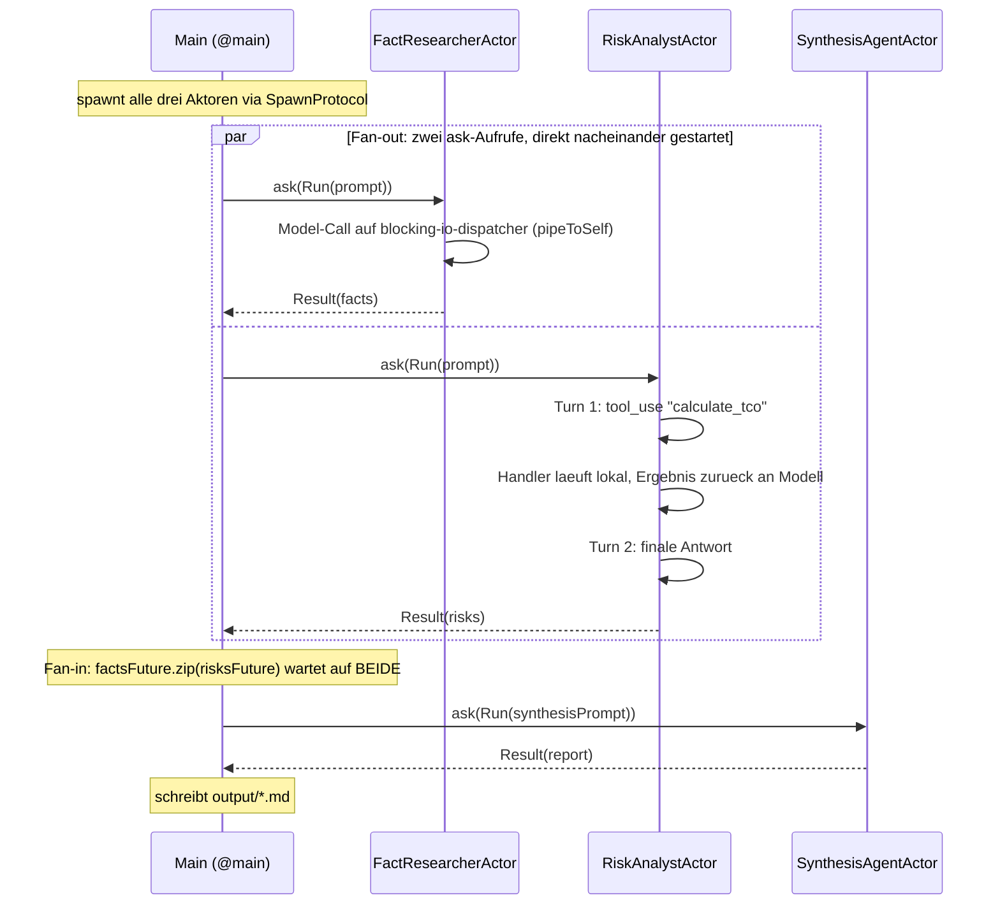
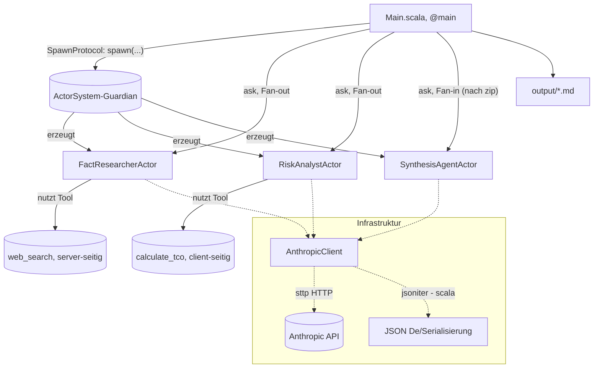

# Multi-Agenten-System mit Pekko-Aktoren (Scala 3 / scala-cli)

## Tech-Stack

| Zweck | Bibliothek |
|---|---|
| Aktorenmodell / Nebenläufigkeit | [Apache Pekko](https://pekko.apache.org/) `pekko-actor-typed` **2.0.0-M4** (Milestone) |
| HTTP-Client (Aufruf der Anthropic API) | [sttp client4](https://sttp.softwaremill.com/) (`DefaultSyncBackend`) |
| JSON-Serialisierung/-Deserialisierung | [jsoniter-scala](https://github.com/plokhotnyuk/jsoniter-scala) (Compile-Time-Codegenerierung) |
| Dateisystemzugriff (`output/`-Ordner) | [os-lib](https://github.com/com-lihaoyi/os-lib) |
| `.env`-Datei einlesen | [dotenv-java](https://github.com/cdimascio/dotenv-java) |
| Build/Run ohne sbt-Projekt | `scala-cli` mit `//> using` Direktiven |

Keine sbt-`build.sbt` nötig - alle Abhängigkeiten werden per Direktive in
`project.scala` deklariert; `scala-cli` löst sie automatisch über Coursier
auf.

**Hinweis zur Pekko-Version:** `2.0.0-M4` ist eine **Milestone-Version**
(Vorabversion der kommenden 2.0-Reihe), bewusst gewählt, um mit der
aktuellen Typed-Actor-API zu arbeiten. Für produktive Projekte sollte
geprüft werden, ob mittlerweile eine stabile `2.0.0`-Version verfügbar ist.

## Die drei Agenten (als Aktoren)

| Agent-Aktor | Rolle | Läuft... | Tools |
|---|---|---|---|
| **FactResearcherActor** (Worker 1) | Sammelt Argumente, Fakten und Quellen *für* eine Technologie | parallel zu Worker 2 | `web_search` (server-seitig) |
| **RiskAnalystActor** (Worker 2) | Sucht gezielt Fallstricke, Kosten, Sicherheitsbedenken, Nachteile | parallel zu Worker 1 | `calculate_tco` (client-seitig, custom) |
| **SynthesisAgentActor** (Worker 3) | Liest beide Outputs, löst Widersprüche auf, erstellt Endbericht | nachdem beide Worker fertig sind | - |

**Es gibt bewusst KEINEN eigenen Orchestrator-Aktor.** Jeder Agent ist ein
eigenständiger, adressierbarer Aktor - die Koordination ("wer läuft wann
parallel, wer wartet auf wen") ist aber ein einmaliger, linearer Ablauf
ohne eigenen Zustand über die Zeit. Dafür braucht es keinen weiteren
Aktor, sondern genügt gewöhnlicher, deklarativer Scala-Code mit
`Future`-Kombinatoren (`ask`, `zip`, `for`-Comprehension) in `Main.scala`

- siehe Abschnitt "Warum kein Orchestrator-Aktor?" unten.

## Ablaufdiagramm (Sequenz)



## Architektur / Aktor-Hierarchie



## Warum kein Orchestrator-Aktor?

In einer ersten Version dieses Projekts gab es einen `Orchestrator`-Aktor (spawnt die drei Worker) sowie einen
zusätzlichen, pro Anfrage neu
erzeugten `PipelineRunner`-Aktor, der das Fan-out/Fan-in als eigene
Zustandsmaschine (`collecting` -> `synthesizing`) abgebildet hat. Das hat
zwar funktioniert, aber unnötige Indirektion erzeugt: zwei zusätzliche
Aktor-Typen, ein eigenes internes Nachrichtenprotokoll (`FactsArrived`,
`RisksArrived`, `ReportArrived`) und die Notwendigkeit, Zwischenzustand
explizit als Aktor-Parameter durchzureichen - für einen Ablauf, der nichts
weiter tut, als zwei Ergebnisse abzuwarten und dann ein drittes
anzufragen.

**Aktoren lohnen sich dort, wo eine Einheit über die Zeit eigenen Zustand
oder eigene Nachrichten verwalten muss** - genau das tun die drei
Agenten-Aktoren: Sie warten auf Model-Antworten und laufen bei Bedarf
mehrstufige Tool-Use-Loops. Reine **Verkettung** von Anfragen ("erst A und
B parallel, dann C") ist dagegen kein Zustand, sondern ein simpler
Kontrollfluss - dafür genügt eine `for`-Comprehension über `Future`s, wie
sie jede Scala-Entwicklerin/jeder Scala-Entwickler kennt:

```scala
for
  factResearcher <- spawn(FactResearcherActor(), "fact-researcher")
  riskAnalyst <- spawn(RiskAnalystActor(), "risk-analyst")
  synthesisAgent <- spawn(SynthesisAgentActor(), "synthesis-agent")

  factsFuture = factResearcher.ask(replyTo => AgentProtocol.Run(..
., replyTo
) )
risksFuture = riskAnalyst.ask(replyTo => AgentProtocol.Run(..
., replyTo
) )

(facts, risks)
<- factsFuture.zip(risksFuture) // Fan-in
report
<- synthesisAgent.ask(replyTo => AgentProtocol.Run(.
.., replyTo
) )
yield PipelineResult(
...)
```

Das liest sich fast wie das `ox.par(...)` aus `research_scala` - nur dass
statt eines direkten Methodenaufrufs ein `ask` an einen Aktor tritt.
Genau dieser 1:1-Vergleich macht (so die These) am ehesten sichtbar, *was
ein Aktor gegenüber einem normalen Objekt zusätzlich bietet* (asynchrone
Nachrichten, eigenes Postfach, Ortsunabhängigkeit) - ohne dass die
Orchestrierung selbst in Aktor-Zeremonie ertrinkt.

**`SpawnProtocol`** ist dabei ein von Pekko fertig mitgeliefertes
"Guardian"-Verhalten, mit dem sich von außerhalb der Aktoren-Welt (hier:
`@main`) neue Aktoren erzeugen und ihre `ActorRef` per `ask`
zurückholen lassen (`system.ask(replyTo => SpawnProtocol.Spawn(behavior, name, Props.empty, replyTo))`).
Das erspart, einen eigenen Guardian-Aktor nur zum Erzeugen der drei
Agenten zu schreiben.

## Blockierendes I/O im Aktor-Modell

Ein Aktor darf seinen eigenen Verarbeitungs-Thread **niemals** lange
blockieren - sonst stehen alle anderen Aktoren still, die zufällig
denselben Dispatcher-Thread-Pool teilen. Der HTTP-Call an die Anthropic-
API (`AnthropicClient.chat` / `chatWithTool`) ist aber blockierend (sttp
`DefaultSyncBackend`).

Lösung in `AgentActor.scala`:

```mermaid
sequenceDiagram
    participant Caller as Aufrufer (ask)
    participant Actor as Agent-Aktor (Standard-Dispatcher)
    participant Blocking as Future auf blocking-io-dispatcher
    participant API as Anthropic API
    Caller ->> Actor: Run(userMessage, maxTokens, replyTo)
    Actor ->> Blocking: context.pipeToSelf(Future { AnthropicClient.chat(...) })
    Note over Actor: Aktor ist SOFORT wieder frei fuer<br/>andere Nachrichten (nicht blockiert!)
    Blocking ->> API: HTTP POST /v1/messages (blockierend)
    API -->> Blocking: Antwort
    Blocking -->> Actor: WrappedResponse(replyTo, Try[String])
    Actor ->> Caller: Result(output) an replyTo
```

Der eigene `blocking-io-dispatcher` (definiert in
`resources/application.conf`, ein klassischer `thread-pool-executor` mit
fester Poolgröße) ist bewusst vom Standard-Dispatcher getrennt - genau wie
man in Pekko/Akka empfiehlt, blockierende Operationen zu isolieren (siehe
[Pekko-Doku zu Dispatchers](https://pekko.apache.org/docs/pekko/current/typed/dispatchers.html)).

## Wichtige Begriffe / Terminologie (für die CCAF-Prüfung)

Alle Begriffe aus `research_scala/README.md` gelten unverändert (Agent,
System Prompt, Multi-Agenten-System, Worker Agent, Synthesis-/Aggregator-
Agent, Fan-out/Fan-in, Tool Use/Function Calling, Grounding, Context
Passing, Content Block, Codec, Backend). Zusätzlich, da aktor-spezifisch:

- **Aktor (Actor)**: Eine gekapselte Recheneinheit mit eigenem, privaten
  Zustand und einem Postfach (Mailbox). Kommuniziert ausschließlich über
  asynchrone Nachrichten - niemals über direkten Methodenaufruf oder
  geteilten veränderlichen Zustand. Verarbeitet eingehende Nachrichten
  strikt **nacheinander** (nie zwei gleichzeitig), wodurch der eigene
  Zustand ohne Locks/Mutexe sicher ist.
- **Behavior**: Die Beschreibung, WIE ein Aktor auf die nächste eingehende
  Nachricht reagiert (welcher Zustand, welche Logik).
- **ActorRef**: Die typisierte "Adresse" eines Aktors, über die man ihm
  Nachrichten schicken kann (`ref ! Message`). Ein `ActorRef[T]` nimmt
  ausschließlich Nachrichten vom Typ `T` entgegen - der Compiler verhindert
  so, dass ein Aktor eine für ihn "unpassende" Nachricht bekommt.
- **ActorSystem**: Der Wurzelknoten und Laufzeit-Container aller Aktoren
  einer Anwendung. Verwaltet Thread-Pools (Dispatcher), Konfiguration (`application.conf`) und den Lebenszyklus aller
  Aktoren.
- **`SpawnProtocol`**: Ein von Pekko fertig mitgeliefertes Guardian-
  Verhalten, das genau eine Aufgabe hat: Aktoren erzeugen und deren
  `ActorRef` per `ask` zurückgeben. Praktisch, wenn man - wie hier - keine
  eigene Guardian-/Orchestrator-Logik braucht.
- **Mailbox**: Die Warteschlange eingehender Nachrichten eines Aktors.
  Nachrichten werden (standardmäßig) FIFO nacheinander abgearbeitet.
- **Dispatcher**: Der Thread-Pool, auf dem Aktoren ihre Nachrichten
  verarbeiten. Mehrere Aktoren teilen sich üblicherweise denselben
  Dispatcher - blockierende Operationen sollten daher auf einen
  dedizierten Dispatcher ausgelagert werden (siehe oben).
- **`ask`-Pattern**: Ermöglicht eine Request-Response-Interaktion mit
  einem Aktor aus Code, der selbst kein Aktor ist (z. B. `@main`).
  Liefert ein `Future[Response]` zurück, das bei Zeitüberschreitung (`Timeout`) fehlschlägt.
- **`pipeToSelf`**: Idiom, um das Ergebnis eines (asynchronen oder auf
  einem anderen Dispatcher laufenden) `Future` als normale Nachricht an
  sich selbst zurückzumelden - der einzige sichere Weg, wie ein Aktor auf
  das Ergebnis einer Hintergrundoperation reagieren kann, ohne seinen
  eigenen Verarbeitungs-Thread zu blockieren.
- **Location Transparency**: Ein `ActorRef` sieht identisch aus, egal ob
  der Ziel-Aktor im selben Prozess läuft oder (bei Cluster-Setups)
  auf einer anderen Maschine. In diesem Projekt laufen alle Aktoren lokal
  in einem Prozess - das Konzept ist aber grundlegend für Pekko/Akka als
  verteilte Systeme.

## Projektstruktur

```
research_scala_pekko/
├── project.scala           # scala-cli Direktiven: Scala-Version & Abhängigkeiten
├── resources/
│   └── application.conf    # Pekko-Konfiguration (u. a. blocking-io-dispatcher)
├── Env.scala                # Liest ANTHROPIC_API_KEY aus ../.env (identisch zu research_scala)
├── AnthropicModels.scala     # jsoniter-scala Request-/Response-Case-Classes + Codecs (identisch)
├── AnthropicClient.scala     # HTTP-Aufruf via sttp + JSON via jsoniter-scala (identisch)
├── AgentProtocol.scala       # Nachrichtenprotokoll (Command/Run/Result) fuer alle Agenten-Aktoren
├── AgentActor.scala          # Generisches Aktor-Verhalten (kapselt Model-Call + Tools + blocking-io)
├── FactResearcherActor.scala # Worker 1 (web_search, server-seitig)
├── RiskAnalystActor.scala    # Worker 2 (calculate_tco, client-seitiges Custom-Tool)
├── SynthesisAgentActor.scala # Worker 3 (Aggregator auf fachlicher Ebene)
├── Main.scala                # Einstiegspunkt + Orchestrierung (SpawnProtocol, ask, Future-Komposition)
├── output/                   # wird beim Ausführen erzeugt (Zwischen- & Endergebnisse)
└── README.md
```

## Ausführen

```bash
cd research_scala_pekko
scala-cli run . -- "Sollten wir Kubernetes für unser 5-Personen-Startup einführen?"
```

Ohne Argument wird ein Standardthema verwendet. Die Ergebnisse landen in
`output/01_fact_researcher.md`, `output/02_risk_analyst.md` und
`output/03_final_report.md`.

## Credentials

Identisch zu `research_scala`: Der API-Key wird aus der `.env`-Datei im
Projekt-Root (`../.env`, Variable `ANTHROPIC_API_KEY` bzw.
`ANTHROPIC_AUTH_TOKEN`) geladen (`Env.scala`, mittels dotenv-java
gelesen). Genutzt wird der Requesty-Router (`https://router.eu.requesty.ai`) mit dem Modell
`vertex/claude-sonnet-5@eu`.

## Vergleich mit `research_scala` auf einen Blick

| Aspekt | `research_scala` (ox) | `research_scala_pekko` (Pekko) |
|---|---|---|
| Agent-Repräsentation | `abstract class Agent` + Methode `run(...)` | `Behavior[AgentProtocol.Command]` (Aktor) |
| Kommunikation | direkter Methodenaufruf (synchron) | asynchrone, typisierte Nachrichten (`ask`) |
| Fan-out/Fan-in | `ox.par(f1, f2)` (strukturierte Nebenläufigkeit, Virtual Threads) | `factsFuture.zip(risksFuture)` (zwei `ask`-Aufrufe + `Future.zip`) in `Main.scala` |
| Orchestrator | eigenes `object Orchestrator` mit `runPipeline(...)` | KEIN eigener Aktor - `for`-Comprehension über `Future`s in `Main.scala` |
| Blockierendes I/O | läuft direkt auf virtuellem Thread (kein Problem, da sehr leichtgewichtig) | ausgelagert auf dedizierten `blocking-io-dispatcher` via `pipeToSelf` |
| Fehlerausbreitung | Exception propagiert durch `par`-Scope | `Try` im `ask`-Callback bzw. Supervision-Strategie des Aktor-Systems |
| Nebenläufigkeitsmodell | Structured Concurrency (Scope-gebunden) | Aktorenmodell (unabhängige, adressierbare Einheiten, Nachrichtenaustausch) |
| Laufzeit-Voraussetzung | JDK 21+ (Virtual Threads) | keine besondere JDK-Version nötig |
