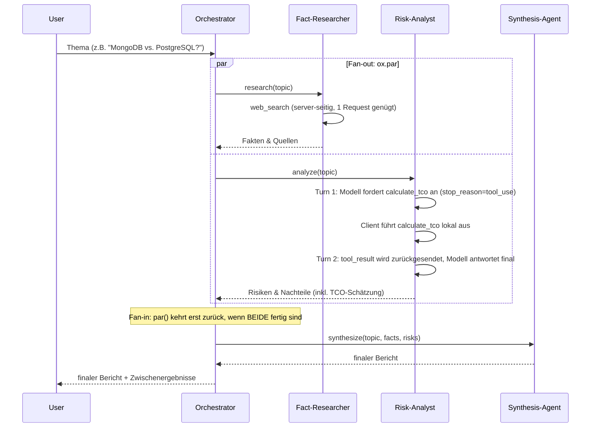
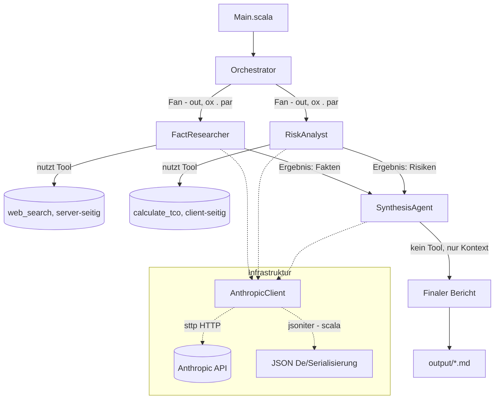
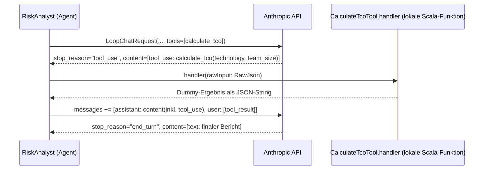

# Einfaches Multi-Agenten-System (Scala 3.9.0 / scala-cli)

Ziel: Verstehen, wie ein Multi-Agenten-System funktioniert -
als Vorbereitung auf die **CCAF (Claude Code Agent Framework)**
Zertifizierung/Prüfung.

Aufgabe des Systems: Zu einer technischen Entscheidung (z. B. "MongoDB vs.
PostgreSQL") wird ein ausgewogener, faktenbasierter Entscheidungsbericht
erstellt.

## Tech-Stack

| Zweck                                             | Bibliothek                                                                                     |
|---------------------------------------------------|------------------------------------------------------------------------------------------------|
| HTTP-Client (Aufruf der Anthropic API)            | [sttp client4](https://sttp.softwaremill.com/) (`DefaultSyncBackend`)                          |
| JSON-Serialisierung/-Deserialisierung             | [jsoniter-scala](https://github.com/plokhotnyuk/jsoniter-scala) (Compile-Time-Codegenerierung) |
| Dateisystemzugriff (`output/`-Ordner)             | [os-lib](https://github.com/com-lihaoyi/os-lib)                                                |
| `.env`-Datei einlesen                             | [dotenv-java](https://github.com/cdimascio/dotenv-java)                                        |
| Nebenläufigkeit (paralleles Ausführen der Worker) | [ox](https://ox.softwaremill.com/) (`par`, strukturierte Nebenläufigkeit auf Virtual Threads)  |
| Build/Run ohne sbt-Projekt                        | `scala-cli` mit `//> using` Direktiven                                                         |

Keine sbt-`build.sbt` nötig - alle Abhängigkeiten werden per Direktive in
`project.scala` deklariert; `scala-cli` löst sie automatisch über Coursier
auf.

**Voraussetzung:** JDK 21+ (wird von `ox` für Virtual Threads benötigt).

## Die drei Agenten

| Agent                          | Rolle                                                             | Läuft...                         | Tools                                   |
|--------------------------------|-------------------------------------------------------------------|----------------------------------|-----------------------------------------|
| **Fact-Researcher** (Worker 1) | Sammelt Argumente, Fakten und Quellen *für* eine Technologie      | parallel zu Worker 2             | `web_search` (server-seitig)            |
| **Risk-Analyst** (Worker 2)    | Sucht gezielt Fallstricke, Kosten, Sicherheitsbedenken, Nachteile | parallel zu Worker 1             | `calculate_tco` (client-seitig, custom) |
| **Synthesis-Agent** (Worker 3) | Liest beide Outputs, löst Widersprüche auf, erstellt Endbericht   | nachdem beide Worker fertig sind | -                                       |

Ein **Orchestrator** koordiniert den Ablauf, ruft die Modelle aber nicht
selbst "intelligent" auf - er ist reine Steuerlogik (kein LLM-Call).

## Ablaufdiagramm (Sequenz)



## Architektur / Datenfluss



## Client-seitiges Tool: der Tool-Use-Loop im Detail

Während `web_search` komplett vom Anthropic-Server ausgeführt wird (ein
einziger Request genügt, siehe `AnthropicClient.chat`), muss ein **client-seitiges (custom) Tool** wie `calculate_tco`
von uns selbst
ausgeführt werden. Das erzeugt einen Mehrschritt-Dialog ("Multi-Turn"),
implementiert in `AnthropicClient.chatWithTool`:



Wichtige Punkte:

- Das Tool wird per **JSON-Schema** (`InputSchema`/`PropertySchema` in
  `AnthropicModels.scala`) definiert - das Modell entscheidet selbst, *ob*
  und *mit welchen Parametern* es aufgerufen wird.
- Da Anthropic's `content`-Feld je nach Nachricht ein String ODER eine
  Liste unterschiedlich geformter Blöcke sein kann, nutzen wir für die
  Multi-Turn-Nachrichten (`LoopMessage`) ein `RawJson`-Wrapper-Feld statt
  eines starr typisierten Case-Class-Baums (siehe Abschnitt "Stolperstein"
  unten).
- Die Original-Antwort des Modells (inkl. `tool_use`-Block, inkl.
  `thinking`-Block mit Signatur!) muss unverändert als `assistant`-Nachricht
  in die Historie zurück, damit das Modell im nächsten Turn weiß, worauf
  sich das `tool_result` bezieht.
- Das `tool_result` wird über die `tool_use_id` dem passenden Aufruf
  zugeordnet.
- Die Schleife (`AnthropicClient.chatWithTool`) läuft so lange, bis
  `stop_reason != "tool_use"` ist.

**Hinweis zur Kombination von Tool-Typen:** Mischt man in einer Anfrage
server-seitige (`web_search`) und client-seitige Tools, erwartet dieser
Router-Endpunkt für **beide** Typen ein `tool_result` - `web_search` wird
also NICHT automatisch aufgelöst, sobald ein Client-Tool im Spiel ist.
Deshalb nutzt der Risk-Analyst in diesem Beispiel bewusst ausschließlich
`calculate_tco`, um den Ablauf klar isoliert zu zeigen.

## Warum parallel?

Fact-Researcher und Risk-Analyst sind voneinander **unabhängig**: keiner
braucht das Zwischenergebnis des anderen, um seine eigene Aufgabe zu lösen.
Solche Worker lassen sich parallelisieren (**Fan-out**), was die
Gesamtlaufzeit deutlich reduziert - denn die längste Wartezeit für ein
Modell (Latenz) tritt nur einmal auf, statt sich zu addieren. Erst der
Synthesis-Agent braucht *beide* Ergebnisse gleichzeitig (**Fan-in** /
Synchronisationspunkt), läuft daher zwangsläufig sequentiell danach.

Im Code (`Orchestrator.scala`) wird das mit [ox](https://ox.softwaremill.com/)
umgesetzt: `par(FactResearcher.research(topic), RiskAnalyst.analyze(topic))`
startet beide Berechnungen auf eigenen Virtual Threads und kehrt erst
zurück, wenn BEIDE fertig sind - Fan-out und Fan-in in einem einzigen
Aufruf. Im Gegensatz zu `scala.concurrent.Future` handelt es sich dabei um **strukturierte Nebenläufigkeit**: Der Scope
von `par` garantiert, dass
keine "verwaisten" Hintergrund-Threads übrig bleiben, und schlägt eine der
beiden Berechnungen fehl, wird die andere automatisch abgebrochen (interrupted) und der Fehler propagiert - ganz ohne
manuelles
Error-Handling für beide Zweige einzeln.

## Wichtige Begriffe / Terminologie (für die CCAF-Prüfung)

- **Agent**: Eine Einheit, die einen LLM-Aufruf mit einer klar definierten
  Rolle (System-Prompt) kapselt und eine abgegrenzte Teilaufgabe löst. Hier
  als `abstract class Agent` in `Agent.scala` modelliert.
- **System Prompt**: Instruktion, die dem Modell *vor* der eigentlichen
  Nutzeranfrage mitgegeben wird und Rolle, Verhalten und Einschränkungen des
  Agenten festlegt (hier z. B. "Du bist der Fact-Researcher... nenne KEINE
  Risiken").
- **Multi-Agenten-System (Multi-Agent System, MAS)**: Mehrere spezialisierte
  Agenten arbeiten zusammen, um eine Aufgabe zu lösen, die ein einzelner
  Agent schlechter oder weniger strukturiert lösen würde (Separation of
  Concerns).
- **Worker Agent**: Ein Agent, der eine Teilaufgabe eigenständig bearbeitet,
  meist ohne Kenntnis der Zwischenergebnisse anderer Worker. Sorgt für
  unabhängige, unvoreingenommene Perspektiven (Fact-Researcher und
  Risk-Analyst kennen sich gegenseitig nicht).
- **Orchestrator**: Die Steuerlogik, die festlegt, *welche* Agenten *wann*
  (sequentiell oder parallel) aufgerufen werden und wie deren Ergebnisse
  weitergereicht werden. Der Orchestrator selbst ist meist kein LLM-Call,
  sondern normaler Code.
- **Synthesis- / Aggregator-Agent**: Ein Agent, der die Ausgaben mehrerer
  Worker als Kontext bekommt und daraus ein konsolidiertes Ergebnis
  erzeugt. Löst dabei auch inhaltliche Widersprüche zwischen den
  Worker-Ergebnissen auf.
- **Fan-out / Fan-in**: Verteilungsmuster, bei dem eine Aufgabe an mehrere
  unabhängige Worker verteilt wird (Fan-out) und deren Ergebnisse später an
  einer Stelle zusammengeführt werden (Fan-in). In Scala umgesetzt über
  `ox.par(...)`, das beide Berechnungen parallel startet und blockiert, bis
  beide Ergebnisse vorliegen.
- **Strukturierte Nebenläufigkeit (Structured Concurrency)**: Ein
  Nebenläufigkeits-Modell, bei dem der "Scope" einer parallelen Operation (hier: `par`) exakt an den Lebenszyklus des
  aufrufenden Codes gebunden
  ist - alle gestarteten Threads sind entweder erfolgreich beendet, oder
  wurden abgebrochen, BEVOR der umgebende Aufruf zurückkehrt. Verhindert
  "verwaiste" Hintergunds-Threads, wie sie bei freischwebenden `Future`s
  entstehen können. `ox` implementiert dies auf Basis von Java Virtual
  Threads (JDK 21+).
- **Tool Use / Function Calling**: Die Fähigkeit eines Modells, während der
  Antwortgenerierung definierte externe Werkzeuge aufzurufen, um an
  Informationen zu gelangen oder Aktionen auszuführen, die nicht im
  Trainingswissen enthalten sind (Grounding) bzw. nicht direkt im Modell
  ausgeführt werden können. Man unterscheidet:
- **Server-seitiges Tool**: Ein Tool wie `web_search_20250305`, das direkt
  vom Anthropic-Server ausgeführt wird - der Client muss den Tool-Aufruf
  nicht selbst abfangen und beantworten. Ein einzelner Request genügt (`AnthropicClient.chat`).
- **Client-seitiges (custom) Tool**: Ein selbst definiertes Tool (z. B.
  `calculate_tco` beim Risk-Analyst) mit eigenem JSON-Schema (`InputSchema`). Das Modell liefert nur den *Wunsch*, das
  Tool
  aufzurufen (`stop_reason == "tool_use"`), zurück - die eigentliche
  Ausführung übernimmt eine lokale Handler-Funktion (`CalculateTcoTool.handler`). Das Ergebnis muss danach explizit als
  `tool_result` an das Modell zurückgesendet werden (Multi-Turn-Dialog,
  `AnthropicClient.chatWithTool`).
- **Tool-Handler**: Die lokale Funktion, die ein client-seitiges Tool
  tatsächlich ausführt (hier: `CalculateTcoTool.handler` in
  `RiskAnalyst.scala`). Bekommt die vom Modell gewählten Parameter als
  `RawJson` und liefert einen String (meist JSON) als Ergebnis zurück.
- **`tool_use` / `tool_result` Block**: Content-Block-Typen im
  Anthropic-Message-Format. `tool_use` = Aufrufwunsch des Modells (Name +
  Parameter + eindeutige `id`); `tool_result` = die Antwort des Client
  darauf, referenziert über `tool_use_id`.
- **Grounding**: Antworten eines Modells durch externe, verifizierbare
  Quellen (z. B. Websuche-Ergebnisse) absichern, statt sich nur auf
  internes Modellwissen zu verlassen.
- **Context Passing**: Das Weiterreichen der Ausgabe eines Agenten als
  Eingabe-Kontext für einen anderen Agenten (hier: Fakten + Risiken werden
  als Text in den Prompt des Synthesis-Agent eingebettet).
- **Content Block**: Die Antwort eines Anthropic-Modells besteht aus einer
  Liste von Content-Blöcken unterschiedlichen Typs (`text`,
  `server_tool_use`, `web_search_tool_result`, ...). Für den finalen
  Bericht werden nur die `text`-Blöcke extrahiert (`AnthropicClient.chat`).
- **Codec (jsoniter-scala)**: Eine zur Compile-Zeit generierte
  Serialisierungs-/Deserialisierungslogik für einen bestimmten Typ (`given JsonValueCodec[T]`). Im Gegensatz zu
  reflection-basierten
  JSON-Bibliotheken entsteht dadurch kein Laufzeit-Overhead.
- **Backend (sttp)**: Die konkrete HTTP-Implementierung, die sttp zum
  tatsächlichen Senden von Requests nutzt. Hier `DefaultSyncBackend`
  (synchron, blockierend, intern auf `java.net.http.HttpClient` basierend).
- **Virtual Thread**: Ein von der JVM (ab JDK 21) verwalteter, extrem
  leichtgewichtiger Thread. Im Gegensatz zu klassischen Plattform-Threads
  können davon Millionen gleichzeitig existieren, ohne dass jeder ein
  eigenes Betriebssystem-Thread belegt. `ox` nutzt Virtual Threads als
  Grundlage für `par`, `fork` & Co.

## Projektstruktur

```
research_scala/
├── project.scala        # scala-cli Direktiven: Scala-Version & Abhängigkeiten
├── Env.scala             # Liest ANTHROPIC_API_KEY aus ../.env (via os-lib)
├── Models.scala           # Modell-Konstanten (Sonnet/Haiku)
├── AnthropicModels.scala  # jsoniter-scala Request-/Response-Case-Classes + Codecs
├── AnthropicClient.scala  # HTTP-Aufruf via sttp + JSON via jsoniter-scala
├── Agent.scala            # Basisklasse Agent (kapselt Model-Call + Tools)
├── FactResearcher.scala   # Worker 1 (web_search, server-seitig)
├── RiskAnalyst.scala      # Worker 2 (calculate_tco, client-seitiges Custom-Tool)
├── SynthesisAgent.scala   # Worker 3 (Aggregator)
├── Orchestrator.scala     # Fan-out/Fan-in-Steuerung (ox.par)
├── Main.scala             # Einstiegspunkt (@main), schreibt output/*.md via os-lib
├── output/                # wird beim Ausführen erzeugt (Zwischen- & Endergebnisse)
└── README.md
```

## Ausführen

```bash
cd research_scala
scala-cli run . -- "Sollten wir Kubernetes für unser 5-Personen-Startup einführen?"
```

Ohne Argument wird ein Standardthema verwendet. Die Ergebnisse landen in
`output/01_fact_researcher.md`, `output/02_risk_analyst.md` und
`output/03_final_report.md`.

## Credentials

Der API-Key wird aus der `.env`-Datei im Projekt-Root (`../.env`,
Variable `ANTHROPIC_API_KEY`) geladen (`Env.scala`, mittels dotenv-java
gelesen) - analog zum Python-Pendant in `../tutorial/init.py` bzw.
`../research/init.py`. Genutzt wird der Requesty-Router (`https://router.eu.requesty.ai`) mit dem Modell
`vertex/claude-sonnet-5@eu`. Authentifiziert wird - wie im offiziellen
Anthropic-SDK - über die Header `x-api-key` und
`anthropic-version: 2023-06-01`.

## Stolpersteine mit jsoniter-scala

**1. `transientDefault`:** Beim Serialisieren des `web_search`-Tools (`WebSearchTool` mit Default-Werten für `type`,
`name`, `max_uses`) hat
jsoniter-scala standardmäßig **alle Felder weggelassen**, die zufällig
ihrem Default-Wert entsprachen (`transientDefault = true` per Default) -
das Ergebnis war ein leeres `{}` statt einer gültigen Tool-Definition, was
die Anthropic API mit einem 400er-Fehler quittierte. Fix: Codec explizit
mit `JsonCodecMaker.make(CodecMakerConfig.withTransientDefault(false))`
erzeugen (siehe `AnthropicModels.scala`).

**2. Dynamisches `content`-Feld:** Anthropic's Message-Format erlaubt für
`content` entweder einen einfachen String ODER eine Liste heterogener
Content-Blöcke (`text`, `thinking`, `tool_use`, ...). Rein statisch
typisierte jsoniter-scala-Case-Classes können das nicht direkt abbilden.
Lösung: Ein `RawJson`-Wrapper-Typ mit **handgeschriebenem** (nicht
makro-generiertem) Codec, der die Bytes über `JsonWriter.writeRawVal` /
`JsonReader.readRawValAsBytes` unverändert durchreicht (siehe
`AnthropicModels.RawJson`). So lässt sich z. B. eine komplette,
vom Server erhaltene `content`-Liste unverändert in die nächste Anfrage
zurückspielen.

**3. `thinking`-Block muss vollständig erhalten bleiben:** Anfangs hatte
unser `ContentBlock`-Modell keine Felder für `thinking`/`signature`. Beim
Zurücksenden der Assistant-Antwort (inkl. `thinking`-Block) an die API kam
dadurch ein unvollständiger Block an ("each thinking block must contain
thinking") - die API lehnte den Request mit 400 ab. Fix: `ContentBlock`
um die Felder `thinking: Option[String]` und `signature: Option[String]`
ergänzt, damit sie beim Re-Serialisieren erhalten bleiben.

**4. Eindeutige Codec-Namen:** Mehrere `given JsonValueCodec[List[X]]`
ohne expliziten Namen führten zu Compile-Fehlern ("Conflicting
definitions"), da der Compiler für alle `List[_]`-Codecs denselben
Default-Namen generiert. Fix: Jedem `given` einen eigenen Namen geben (z. B.
`given contentBlockListCodec: JsonValueCodec[List[ContentBlock]]`).
