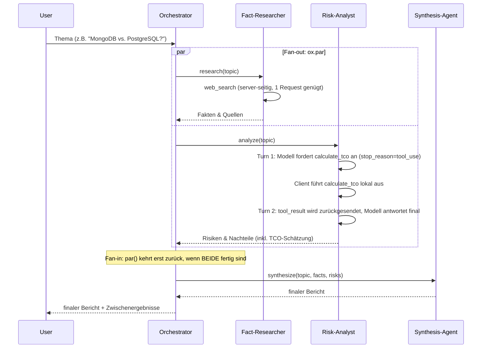
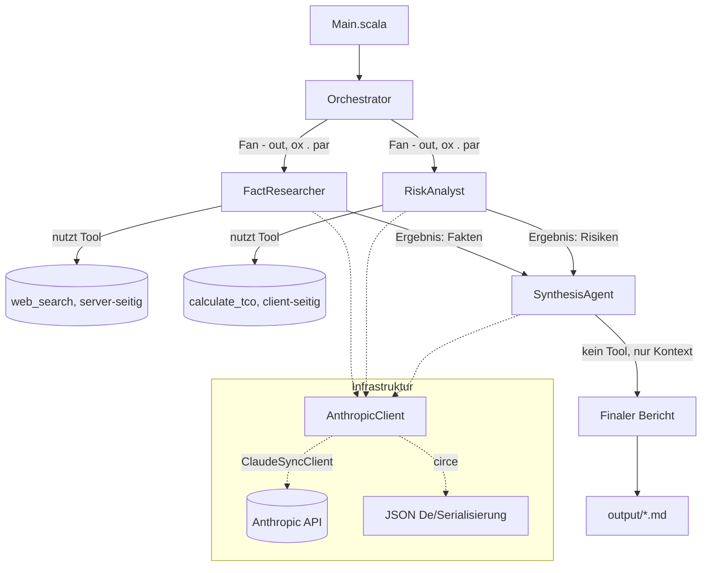
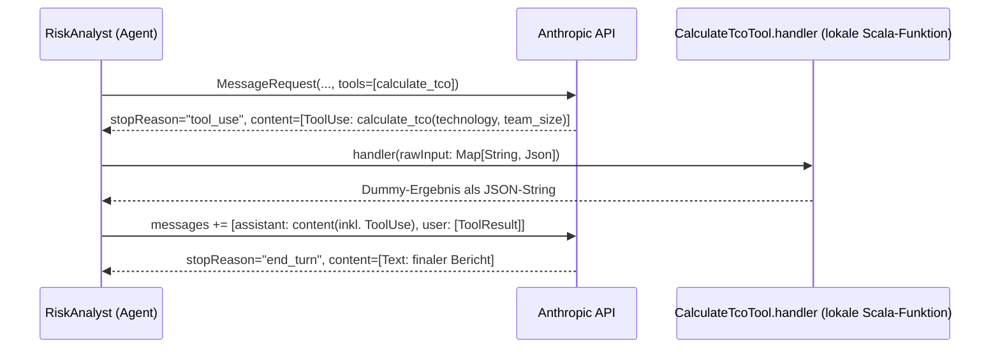

# Einfaches Multi-Agenten-System (Scala 3.9.0 / scala-cli)

Ziel: Verstehen, wie ein Multi-Agenten-System funktioniert -
als Vorbereitung auf die **CCAF (Claude Code Agent Framework)**
Zertifizierung/Prüfung.

Aufgabe des Systems: Zu einer technischen Entscheidung (z. B. "MongoDB vs.
PostgreSQL") wird ein ausgewogener, faktenbasierter Entscheidungsbericht
erstellt.

## Tech-Stack

| Zweck                                             | Bibliothek                                                                                     |
|---------------------------------------------------|------------------------------------------------------------------------------------------------|
| Anthropic-/Claude-Client (Messages API, Tools)    | [sttp-ai](https://sttp-ai.softwaremill.com/) (`claude`-Modul, `ClaudeSyncClient`)               |
| JSON-Serialisierung/-Deserialisierung             | [circe](https://circe.github.io/circe/) (bringt `sttp-ai` bereits mit, keine eigene Abhängigkeit) |
| Dateisystemzugriff (`output/`-Ordner)             | [os-lib](https://github.com/com-lihaoyi/os-lib)                                                |
| `.env`-Datei einlesen                             | eigene, simple Implementierung (`Env.scala`, siehe unten)                                       |
| Nebenläufigkeit (paralleles Ausführen der Worker) | [ox](https://ox.softwaremill.com/) (`par`, strukturierte Nebenläufigkeit auf Virtual Threads)  |
| Build/Run ohne sbt-Projekt                        | `scala-cli` mit `//> using` Direktiven                                                         |

Keine sbt-`build.sbt` nötig - alle Abhängigkeiten werden per Direktive in
`project.scala` deklariert; `scala-cli` löst sie automatisch über Coursier
auf.

**Voraussetzung:** JDK 21+ (wird von `ox` für Virtual Threads benötigt).

## Die drei Agenten

| Agent                          | Rolle                                                             | Läuft...                         | Tools                                   |
|--------------------------------|-------------------------------------------------------------------|----------------------------------|-----------------------------------------|
| **Fact-Researcher** (Worker 1) | Sammelt Argumente, Fakten und Quellen *für* eine Technologie      | parallel zu Worker 2             | `web_search` (server-seitig)            |
| **Risk-Analyst** (Worker 2)    | Sucht gezielt Fallstricke, Kosten, Sicherheitsbedenken, Nachteile | parallel zu Worker 1             | `calculate_tco` (client-seitig, custom) |
| **Synthesis-Agent** (Worker 3) | Liest beide Outputs, löst Widersprüche auf, erstellt Endbericht   | nachdem beide Worker fertig sind | -                                       |

Ein **Orchestrator** koordiniert den Ablauf, ruft die Modelle aber nicht
selbst "intelligent" auf - er ist reine Steuerlogik (kein LLM-Call).

## Ablaufdiagramm (Sequenz)



## Architektur / Datenfluss



## Client-seitiges Tool: der Tool-Use-Loop im Detail

Während `web_search` komplett vom Anthropic-Server ausgeführt wird (ein
einziger Request genügt, siehe `AnthropicClient.chat`), muss ein **client-seitiges (custom) Tool** wie `calculate_tco`
von uns selbst
ausgeführt werden. Das erzeugt einen Mehrschritt-Dialog ("Multi-Turn"),
implementiert in `AnthropicClient.chatWithTool`:



Wichtige Punkte:

- Das Tool wird per **JSON-Schema** (`ToolInputSchema`/`PropertySchema` aus
  `sttp.ai.claude.models`) definiert - das Modell entscheidet selbst, *ob*
  und *mit welchen Parametern* es aufgerufen wird.
- `sttp-ai` bildet Anthropic's `content`-Feld bereits als typisiertes
  ADT (`sealed trait ContentBlock` mit `Text`, `ToolUse`, `ToolResult`, ...)
  ab - ein eigener `RawJson`-Wrapper wie in der Vorgänger-Implementierung
  entfällt dadurch vollständig.
- Die Original-Antwort des Modells (inkl. `ToolUse`-Block) muss als
  `assistant`-Nachricht unverändert in die Historie zurück, damit das
  Modell im nächsten Turn weiß, worauf sich das `ToolResult` bezieht (siehe
  aber Stolperstein zu `Thinking`-Blöcken unten).
- Das `ToolResult` wird über die `toolUseId` dem passenden Aufruf
  zugeordnet.
- Die Schleife (`AnthropicClient.chatWithTool`) läuft so lange, bis
  `stopReason != "tool_use"` ist.

**Hinweis zur Kombination von Tool-Typen:** Mischt man in einer Anfrage
server-seitige (`web_search`) und client-seitige Tools, erwartet dieser
Router-Endpunkt für **beide** Typen ein `tool_result` - `web_search` wird
also NICHT automatisch aufgelöst, sobald ein Client-Tool im Spiel ist.
Deshalb nutzt der Risk-Analyst in diesem Beispiel bewusst ausschließlich
`calculate_tco`, um den Ablauf klar isoliert zu zeigen.

## Warum parallel?

Fact-Researcher und Risk-Analyst sind voneinander **unabhängig**: keiner
braucht das Zwischenergebnis des anderen, um seine eigene Aufgabe zu lösen.
Solche Worker lassen sich parallelisieren (**Fan-out**), was die
Gesamtlaufzeit deutlich reduziert - denn die längste Wartezeit für ein
Modell (Latenz) tritt nur einmal auf, statt sich zu addieren. Erst der
Synthesis-Agent braucht *beide* Ergebnisse gleichzeitig (**Fan-in** /
Synchronisationspunkt), läuft daher zwangsläufig sequentiell danach.

Im Code (`Orchestrator.scala`) wird das mit [ox](https://ox.softwaremill.com/)
umgesetzt: `par(FactResearcher.research(topic), RiskAnalyst.analyze(topic))`
startet beide Berechnungen auf eigenen Virtual Threads und kehrt erst
zurück, wenn BEIDE fertig sind - Fan-out und Fan-in in einem einzigen
Aufruf. Im Gegensatz zu `scala.concurrent.Future` handelt es sich dabei um **strukturierte Nebenläufigkeit**: Der Scope
von `par` garantiert, dass
keine "verwaisten" Hintergrund-Threads übrig bleiben, und schlägt eine der
beiden Berechnungen fehl, wird die andere automatisch abgebrochen (interrupted) und der Fehler propagiert - ganz ohne
manuelles
Error-Handling für beide Zweige einzeln.

## Wichtige Begriffe / Terminologie (für die CCAF-Prüfung)

- **Agent**: Eine Einheit, die einen LLM-Aufruf mit einer klar definierten
  Rolle (System-Prompt) kapselt und eine abgegrenzte Teilaufgabe löst. Hier
  als `abstract class Agent` in `Agent.scala` modelliert.
- **System Prompt**: Instruktion, die dem Modell *vor* der eigentlichen
  Nutzeranfrage mitgegeben wird und Rolle, Verhalten und Einschränkungen des
  Agenten festlegt (hier z. B. "Du bist der Fact-Researcher... nenne KEINE
  Risiken").
- **Multi-Agenten-System (Multi-Agent System, MAS)**: Mehrere spezialisierte
  Agenten arbeiten zusammen, um eine Aufgabe zu lösen, die ein einzelner
  Agent schlechter oder weniger strukturiert lösen würde (Separation of
  Concerns).
- **Worker Agent**: Ein Agent, der eine Teilaufgabe eigenständig bearbeitet,
  meist ohne Kenntnis der Zwischenergebnisse anderer Worker. Sorgt für
  unabhängige, unvoreingenommene Perspektiven (Fact-Researcher und
  Risk-Analyst kennen sich gegenseitig nicht).
- **Orchestrator**: Die Steuerlogik, die festlegt, *welche* Agenten *wann*
  (sequentiell oder parallel) aufgerufen werden und wie deren Ergebnisse
  weitergereicht werden. Der Orchestrator selbst ist meist kein LLM-Call,
  sondern normaler Code.
- **Synthesis- / Aggregator-Agent**: Ein Agent, der die Ausgaben mehrerer
  Worker als Kontext bekommt und daraus ein konsolidiertes Ergebnis
  erzeugt. Löst dabei auch inhaltliche Widersprüche zwischen den
  Worker-Ergebnissen auf.
- **Fan-out / Fan-in**: Verteilungsmuster, bei dem eine Aufgabe an mehrere
  unabhängige Worker verteilt wird (Fan-out) und deren Ergebnisse später an
  einer Stelle zusammengeführt werden (Fan-in). In Scala umgesetzt über
  `ox.par(...)`, das beide Berechnungen parallel startet und blockiert, bis
  beide Ergebnisse vorliegen.
- **Strukturierte Nebenläufigkeit (Structured Concurrency)**: Ein
  Nebenläufigkeits-Modell, bei dem der "Scope" einer parallelen Operation (hier: `par`) exakt an den Lebenszyklus des
  aufrufenden Codes gebunden
  ist - alle gestarteten Threads sind entweder erfolgreich beendet, oder
  wurden abgebrochen, BEVOR der umgebende Aufruf zurückkehrt. Verhindert
  "verwaiste" Hintergunds-Threads, wie sie bei freischwebenden `Future`s
  entstehen können. `ox` implementiert dies auf Basis von Java Virtual
  Threads (JDK 21+).
- **Tool Use / Function Calling**: Die Fähigkeit eines Modells, während der
  Antwortgenerierung definierte externe Werkzeuge aufzurufen, um an
  Informationen zu gelangen oder Aktionen auszuführen, die nicht im
  Trainingswissen enthalten sind (Grounding) bzw. nicht direkt im Modell
  ausgeführt werden können. Man unterscheidet:
- **Server-seitiges Tool**: Ein Tool wie `web_search_20250305`, das direkt
  vom Anthropic-Server ausgeführt wird - der Client muss den Tool-Aufruf
  nicht selbst abfangen und beantworten. Ein einzelner Request genügt (`AnthropicClient.chat`).
- **Client-seitiges (custom) Tool**: Ein selbst definiertes Tool (z. B.
  `calculate_tco` beim Risk-Analyst) mit eigenem JSON-Schema (`ToolInputSchema`). Das Modell liefert nur den *Wunsch*, das
  Tool
  aufzurufen (`stopReason == "tool_use"`), zurück - die eigentliche
  Ausführung übernimmt eine lokale Handler-Funktion (`CalculateTcoTool.handler`). Das Ergebnis muss danach explizit als
  `ContentBlock.ToolResult` an das Modell zurückgesendet werden (Multi-Turn-Dialog,
  `AnthropicClient.chatWithTool`).
- **Tool-Handler**: Die lokale Funktion, die ein client-seitiges Tool
  tatsächlich ausführt (hier: `CalculateTcoTool.handler` in
  `RiskAnalyst.scala`). Bekommt die vom Modell gewählten Parameter als
  `Map[String, io.circe.Json]` und liefert einen String (meist JSON) als Ergebnis zurück.
- **`ToolUse` / `ToolResult` Block**: Content-Block-Typen im
  Anthropic-Message-Format (in `sttp-ai` als `ContentBlock.ToolUse` /
  `ContentBlock.ToolResult` modelliert). `ToolUse` = Aufrufwunsch des
  Modells (Name + Parameter + eindeutige `id`); `ToolResult` = die Antwort
  des Client darauf, referenziert über `toolUseId`.
- **Grounding**: Antworten eines Modells durch externe, verifizierbare
  Quellen (z. B. Websuche-Ergebnisse) absichern, statt sich nur auf
  internes Modellwissen zu verlassen.
- **Context Passing**: Das Weiterreichen der Ausgabe eines Agenten als
  Eingabe-Kontext für einen anderen Agenten (hier: Fakten + Risiken werden
  als Text in den Prompt des Synthesis-Agent eingebettet).
- **Content Block**: Die Antwort eines Anthropic-Modells besteht aus einer
  Liste von Content-Blöcken unterschiedlichen Typs (`Text`, `ServerToolUse`,
  `WebSearchToolResult`, ...), in `sttp-ai` als `sealed trait ContentBlock`
  mit Fallklassen abgebildet. Für den finalen Bericht werden nur die
  `Text`-Blöcke extrahiert (`AnthropicClient.chat`).
- **Codec (circe)**: Typklassen-basierte Serialisierungs-/
  Deserialisierungslogik für einen bestimmten Typ (`Codec[T]` bzw.
  `Codec.AsObject[T]`), von `sttp-ai` selbst für alle API-Modelle
  bereitgestellt bzw. per `derives Codec.AsObject` für eigene Typen
  (`CalculateTcoInput`/`CalculateTcoResult` in `RiskAnalyst.scala`)
  ableitbar.
- **`ClaudeSyncClient` (sttp-ai)**: Der blockierende, hochsprachliche
  Claude-Client aus `sttp-ai`, der Requests direkt als Response-Werte
  zurückgibt und im Fehlerfall eine `ClaudeException`-Unterklasse wirft
  (statt `Either`, wie es der rohe `ClaudeClient` täte). Nutzt intern
  weiterhin `sttp-client4` als HTTP-Backend (`DefaultSyncBackend`, basiert
  auf `java.net.http.HttpClient`).
- **Virtual Thread**: Ein von der JVM (ab JDK 21) verwalteter, extrem
  leichtgewichtiger Thread. Im Gegensatz zu klassischen Plattform-Threads
  können davon Millionen gleichzeitig existieren, ohne dass jeder ein
  eigenes Betriebssystem-Thread belegt. `ox` nutzt Virtual Threads als
  Grundlage für `par`, `fork` & Co.

## Projektstruktur

```
research_scala/
├── project.scala        # scala-cli Direktiven: Scala-Version & Abhängigkeiten
├── Env.scala             # Liest ANTHROPIC_API_KEY aus ../.env (via os-lib)
├── AnthropicClient.scala  # Wrapper um sttp-ai's ClaudeSyncClient + Logging + Tool-Use-Loop
├── Agent.scala            # Basisklasse Agent (kapselt Model-Call + Tools)
├── FactResearcher.scala   # Worker 1 (web_search, server-seitig)
├── RiskAnalyst.scala      # Worker 2 (calculate_tco, client-seitiges Custom-Tool)
├── SynthesisAgent.scala   # Worker 3 (Aggregator)
├── Orchestrator.scala     # Fan-out/Fan-in-Steuerung (ox.par)
├── Main.scala             # Einstiegspunkt (@main), schreibt output/*.md via os-lib
├── output/                # wird beim Ausführen erzeugt (Zwischen- & Endergebnisse)
└── README.md
```

## Ausführen

```bash
cd research_scala
scala-cli run . -- "Sollten wir Kubernetes für unser 5-Personen-Startup einführen?"
```

Ohne Argument wird ein Standardthema verwendet. Die Ergebnisse landen in
`output/01_fact_researcher.md`, `output/02_risk_analyst.md` und
`output/03_final_report.md`.

## Credentials

Der API-Key wird aus der `.env`-Datei im Projekt-Root (`.env` im
Projektordner, Variable `ANTHROPIC_API_KEY`, alternativ
`ANTHROPIC_AUTH_TOKEN`) geladen (`Env.scala`, eigene, simple
`os-lib`-basierte Implementierung ohne zusätzliche Dependency) - analog zum
Python-Pendant in `../tutorial/init.py` bzw. `../research/init.py`. Genutzt
wird der Requesty-Router (`https://router.eu.requesty.ai`) mit dem Modell
`vertex/claude-sonnet-5@eu`, konfiguriert über `ClaudeConfig(baseUrl = ...)`
aus `sttp-ai`. Authentifiziert wird - wie im offiziellen Anthropic-SDK -
über die Header `x-api-key` und `anthropic-version: 2023-06-01`, die
`sttp-ai` automatisch setzt.

## Stolpersteine mit sttp-ai

**1. Custom Base-URL statt offizieller Anthropic-Endpoint:** Dieses Projekt
spricht (wie das Python-Pendant) einen Requesty-Router statt
`https://api.anthropic.com` an. `sttp-ai`s `ClaudeConfig` unterstützt das
direkt über den `baseUrl`-Parameter (`Uri`) - `v1/messages` wird vom Client
selbst angehängt, man darf den Pfad also NICHT mit angeben (siehe
`AnthropicClient.scala`). `ClaudeConfig.fromEnv`/`ClaudeSyncClient.fromEnv`
wurden hier bewusst NICHT genutzt, da sie nur `sys.env` lesen - dieses
Projekt liest den API-Key stattdessen über die projekteigene
`Env.scala` (die zusätzlich `../.env` einliest und den Fallback-Namen
`ANTHROPIC_AUTH_TOKEN` unterstützt).

**2. `ContentBlock.Thinking` ohne `signature`-Feld:** Anthropic verlangt beim
Zurücksenden von `thinking`-Blöcken (z. B. nach einem `tool_use`-Turn)
eigentlich die unverändert erhaltene `signature`, um die Integrität der
Reasoning-Kette zu prüfen. `sttp-ai` 0.11.0 bildet `ContentBlock.Thinking`
jedoch nur mit einem einzigen Feld ab (`thinking: String`, keine
`signature`) - eine Signatur kann also gar nicht transportiert werden.
Sendet man einen (gelegentlich fast leeren) `thinking`-Block unverändert
zurück, lehnt die API den Request mit `"each thinking block must contain
thinking"` ab. Workaround in `AnthropicClient.chatWithTool`: leere
`Thinking`-Blöcke werden vor dem Zurücksenden herausgefiltert. Das behebt
das beobachtete Fehlerbild, ändert aber nichts daran, dass diese
sttp-ai-Version für Modelle mit **erzwungener** Signatur-Prüfung bei
nicht-leeren Thinking-Blöcken (echtes Extended Thinking) derzeit keine
korrekte Lösung anbietet - das wäre nur durch ein Upstream-Fix in
`sttp-ai` behebbar.

**3. Mischen von server- und client-seitigen Tools:** Unabhängig von der
Bibliothek gilt weiterhin: Mischt man in einer Anfrage server-seitige
(`web_search`) und client-seitige Tools, erwartet der hier genutzte
Router-Endpunkt für **beide** Typen ein `tool_result` - `web_search` wird
also NICHT automatisch aufgelöst, sobald ein Client-Tool im Spiel ist.
Deshalb nutzt der Risk-Analyst in diesem Beispiel bewusst ausschließlich
`calculate_tco`.

**4. Eigene Tool-Eingabe-/Ergebnis-Typen bleiben nötig:** `sttp-ai` liefert
Tool-Eingabeparameter als rohes `Map[String, io.circe.Json]`
(`ContentBlock.ToolUse.input`). Für ein sauberes, typisiertes Case-Class-
Schema (hier `CalculateTcoInput`/`CalculateTcoResult`) genügt in Scala 3
weiterhin `derives Codec.AsObject` - `circe` ist als Abhängigkeit von
`sttp-ai` bereits transitiv vorhanden, es muss keine eigene JSON-Bibliothek
mehr eingebunden werden.
